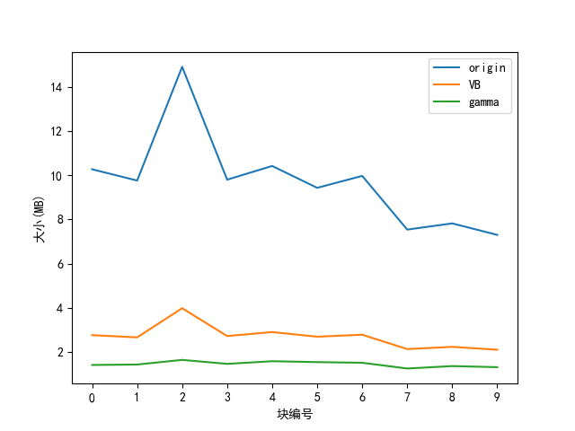

# hw1：布尔索引

> 姓名：王茂增\
> 学号：2113972\
> 代码：https://github.com/mzwangg/InformationRetrieval

## 总体流程

1. **构建索引**：构建倒排索引
   1. **遍历每一个块**：从第 0 块开始向上遍历
      1. **parse_block()函数**：在该函数中遍历块中每个文件，生成格式为`[(term_id, doc_id), (term_id, doc_id),...]`的列表`td_pairs`
      2. **invert_write()函数**：在该函数中将本块中的所有`td_pairs`处理为 term_id 与其对应的文档 id 列表 postings_list 的形式（如 1:[2, 3, 4]，表示 id 为 1 的词项出现在了 id 为 2、3、、4 的文档中）。最后通过`append()`将该信息保存在磁盘
         1. **append()函数**：在该函数中将 postings_list 压缩并写入磁盘，在内存中通过(索引文件开始位置, 文档数， 索引文件大小)三元组记录下在磁盘中找到该 postings_list 的必要信息
            1. **UncompressedPostings 类**：该类直接将 postings_list 中的每个元素作为`无符号长整型`并写入磁盘
            2. **CompressedPostings 类**: 该类通过 VB 编码进行压缩，主要思想是将文档 id 的 gap 表示为可变长字节编码，其中每个字节的第一位是延续位，只有最后一个字节的延续位为 1，表示结束。
            3. **ECCompressedPostings 类**：该类通过 gamma 编码进行压缩，将每个 gap 表示为长度加偏移的可变长编码，可以以 bit 为单位进行更细致的压缩。
   2. **保存映射**：保存词项到词项 id、文档相对地址到文档 id 的映射
   3. **合并索引**：通过`merge()`函数根据每个块的倒排索引的迭代器合并为一个总的倒排索引
      1. **InvertedIndexIterator 类**：该类是一个迭代器，每次调用`__next__()`函数时都会返回一个(term, postings_list)元组
      2. **merge()函数**：该函数通过`heapq.merge(*indices)`以从小到大遍历每个 term_id 和对应的 doc_id。并将其合并为一个新的倒排索引
2. **布尔联合检索**：根据倒排索引进行布尔联合检索
   1. **遍历每个 term**：按照输入的 term 的次序进行遍历
      1. **\_get_postings_list()函数**：该函数可根据 term 在磁盘中找到对应 postings_list 的存储位置并读取、解码、返回
   2. **按照元素个数排序**：从元素个数较少的 postings_list 开始求交，可降低搜索的时间
   3. **sorted_intersect()函数**：该函数可对已排序的列表进行求交

## 代码介绍

### 索引构建

#### IdMap 类

**作用**：该类用于将字符串和数字 ID 进行相互映射，以满足我们在 term 和 termID、doc 和 docID 间转换的需求。

**实现**：在下列函数中，`id_to_str` 是一个列表， `str_to_id` 是一个字典，直接存储 id 和 str 的对应信息。在 `_get_id()` 中，如果当前的 str 不在 list 中，则需要 append，id 就是按照 str 加入 list 的先后顺序确定的。

```python
# 该函数返回term_id对应的string
def _get_str(self, i):
    # 需要进行边界检查，当越界时返回IndexError
    return self.id_to_str[i] if 0 <= i <= len(self.id_to_str) else IndexError

# 该函数返回string对应的id，如果没有则新建一个id
def _get_id(self, s):
    # 字符串存在时返回相应的标识符。否则，新建并返回字符串的大小作为id
    if s not in self.str_to_id.keys():
        # 当字符串不存在时加入字典及列表
        self.str_to_id[s] = len(self.id_to_str)
        self.id_to_str.append(s)
    return self.str_to_id.get(s) # 返回对应的id
```

#### parse_block()函数

**作用**：该函数用于根据块中的每个文档生成包含(term_id, doc_id)元组的列表。

**实现**：它通过循环读取块中的每个文档，并根据空格进行分词。然后根据当前文档的相对地址获取文档 id（若没有对应 id 则会新建一个 id），之后遍历获取每个单词的 id 并组成(term_id, doc_id)元组加入 td_pairs 列表，处理完成后返回 td_pairs 列表。

```python
td_pairs = [] # 用于存储termID-docID元组

# 遍历块中的每个文档
  for file_dir in sorted(os.listdir(os.path.join(self.data_dir, block_dir_relative))):
    relative_path = os.path.join(block_dir_relative, file_dir)
    with open(os.path.join(self.data_dir, relative_path), 'r') as f:
        # 读取文本文件内容，并去除首尾空白字符，然后按空格分割为单词列表
        content = f.read().strip().split()
        # 获取当前文本文件的docID
        doc_id = self.doc_id_map[relative_path]
        # 遍历文档中的每个单词
        for token in content:
            # 获取单词对应的termID
            term_id = self.term_id_map[token]
            # 将termID和docID构成一个元组，并添加到td_pairs列表中
            td_pairs.append((term_id, doc_id))

return td_pairs # 返回包含(term_id, doc_id)元组的列表
```

#### append()函数

**作用**：该函数以 term 和对应的 postings_list 作为输入，用于将 postings_list 压缩并写入磁盘，并在内存中记录下每个 term 对应的(索引文件开始位置, 文档数， 索引文件大小)三元组信息，以在磁盘中找到该 postings_list。

**实现**：该函数首先通过选择的压缩函数对 posting_list 进行压缩，然后将 term 添加到 terms 列表中，并根据`self.index_file.tell()`获取开始写入的位置，根据 len(postings_list)计算文档数量，根据 len(encoded_list)计算压缩后的字节长度，然后将这三个信息保存在三元组中。最后将压缩后的 encoded_list 写入磁盘

```python
 # 1. 编码，将postings_list转换为bytes类型
encoded_list = self.postings_encoding.encode(postings_list)

# 2. 存储元数据
self.terms.append(term)  # 将term添加到terms列表中
start_position_in_index_file = self.index_file.tell()  # 获取当前文件指针位置，即开始写入的位置
number_of_postings_in_list = len(postings_list)  # 计算postings_list中的文档数量
length_in_bytes_of_postings_list = len(encoded_list)  # 计算encoded_list的字节长度
self.postings_dict.update({term: (start_position_in_index_file, number_of_postings_in_list, length_in_bytes_of_postings_list)})  # 将元数据存储到postings_dict中

# 3. 写入文件
self.index_file.write(encoded_list)  # 将encoded_list写入磁盘
```

#### invert_write()函数

**作用**：在该函数中将本块中的所有`td_pairs`处理为 term_id 与其对应的文档 id 列表 postings_list 的形式，并通过`append()`将该信息保存在磁盘

**实现**：为了实现相应的功能，我们首先对 td_pairs 先按照 term_id 排序，后按照 doc_id 排序然后初始化一些值。之后，遍历 td_pairs，如果当前 term 之前已经出现过，则将 term_id 对应的 doc_id 加入 postings_list，否则则将之前一个 term 以及对应的 postings_list 通过`append()`函数加入倒排索引并写入磁盘，然后更新 term_id 和 postings_list，最后要处理一下剩余的一项。

**要点**：值得注意的是，我们最开始将 term_id 初始化为 td_pairs[0][0]，即 td_pairs 中第一个元组的 term，所以第一个元组不会执行保存之前 term 的那部分代码。

```python
# 对td_pairs进行排序， 先按照term_id排序，后按照doc_id排序
td_pairs.sort(key=lambda x: (x[0], x[1]))

# 初始化
term_id = td_pairs[0][0]
postings_list = []

# 遍历td_pairs，生成每个term_id对应的postings_list
for pair in td_pairs:
    # 如果当前term_id还没遍历完毕
    if pair[0] == term_id:
        # 将term_id对应的doc_id加入postings_list
        postings_list.append(pair[1])
    # 如果当前term_id遍历完毕
    else:
        # 将doc_id列表加入InvertedIndexWriter
        index.append(term_id, postings_list)
        # 更新term_id和postings_list
        term_id = pair[0]
        postings_list = [pair[1]]
# 处理最后一项
index.append(term_id, postings_list)
```

#### InvertedIndexIterator 类

**作用**：该类实现了`__next__()`函数，使得`InvertedIndexIterator`类变成一个迭代器，可以进行迭代，每次迭代时返回一个(term, postings_list)元组

**实现**：对于`_initialization_hook()`函数，实现了将当前位置设置为 0 和得到倒排索引的数目。对于`__next__()`函数，我们首先检查当前位置是否已经越界，越界则返回`StopIteration`。若没越界，则得到当前 term 并更新当前位置，然后根据当前 term 得到对应开始位置和长度，根据该信息读取并解压 encoded_postings 后返回(term, postings_list)元组。

```python
# 初始化函数
def _initialization_hook(self):
    self.cur_pos = 0 # 将当前位置初始化为0
    self.num = len(self.terms) # 得到倒排索引的数目

# 实现__next__()函数，构成迭代器
def __next__(self):
    # 当遍历完term后仍然读取下一个，返回StopIteration
    if self.cur_pos >= self.num:
        raise StopIteration

    term = self.terms[self.cur_pos] # 得到当前term
    self.cur_pos += 1 # 更新当前位置
    start_position, _, length_in_bytes = self.postings_dict[term] # 得到对应的三元组
    self.index_file.seek(start_position) # 根据三元组进行定位
    encoded_postings = self.index_file.read(length_in_bytes) # 读取压缩的postings_list
    postings_list = self.postings_encoding.decode(encoded_postings) # 进行解码
    return (term, postings_list) #返回(term, postings_list)元组
```

#### merge()函数

**作用**：该函数根据迭代器列表对每个块的倒排索引进行合并，以得到最终的倒排索引。

**实现**：该函数首先初始化上一次的 term 和 postings，然后通过`heapq.merge(*indices)`以从小到大遍历每个 term_id 和对应的 doc_id。在遍历时，对于相同的 term 时则先将其 postings_list 插入 last_postings 列表，当处理到下一个 term 时，则将 last_postings 去重并排序，然后构建新的倒排列表并写入磁盘。同时，我们要注意处理最后的一项并且由于第一个 term 并没有对应的 last_postings，所以要特判一下。

**要点**：在处理最后一项时，要判断一下 last_term 是否存在，如果不判断则在没有倒排索引列表时会出现错误。

```python
# 初始化上一次的term和postings
last_term = last_postings = None

# heapq.merge用于合并多个已排序的可迭代对象，InvertedIndexIterator是已排序的迭代器，可以使用其进行合并
for cur_term, cur_postings in heapq.merge(*indices):
    if cur_term != last_term: # 当合并到新的term时
        if last_term: # 如果不是第一次合并
            last_postings = list(sorted(set(last_postings)))  # 去重并排序
            merged_index.append(last_term, last_postings) # 构建新的倒排列表并写入磁盘
        # 更新之前的term和postings，以判断什么时候合并到新的term
        last_term = cur_term
        last_postings = cur_postings
    else: # 当还在处理相同的term时
        last_postings.extend(cur_postings) # 合并postings

# 处理最后一项，使用if是为了防止没有倒排索引列表
if last_term:
    last_postings = list(sorted(set(last_postings)))  # 去重并排序
    merged_index.append(last_term, last_postings) # 进行合并
```

### 布尔联合查询

#### \_get_postings_list()函数

**作用**：该函数用于从磁盘读取 term 对应的 postings_list。

**实现**：我们首先判断当前 term 是否存在，若不存在则直接返回空列表。然后根据 postings_dict 找到当前 term 对应的起始地址和大小，然后移动到记录的位置并读取指定大小的数据，最后解码并返回。

```python
if term in self.postings_dict:
    # 根据postings_dict得到该term存储的位置及大小
    start_position, _, length_in_bytes= self.postings_dict[term]
    self.index_file.seek(start_position) # 移动到该位置
    encoded_postings_list = self.index_file.read(length_in_bytes) # 读取指定大小的数据
    posting_list = self.postings_encoding.decode(encoded_postings_list) # 解码
    return posting_list # 返回term对应的postings_list
else:
    return []
```

#### sorted_intersect()函数

**作用**：该函数用于在线性时间内返回两个已排序列表的交集。

**实现**：为了实行该函数，首先进行一些初始化，然后分别遍历两个列表并进行边界检测，当其中一个列表遍历完时显然不会再有交集，所以可以返回交集了。如果两列表还未遍历完毕，当两者不等时增加较小者，相等时则保存交集元素，并都处理下一个元素。

```python
# 初始化
intersection = []
i = j = 0

# 进行边界检测，当其中一个列表遍历完时显然不会再有交集
while i < len(list1) and j < len(list2):
    # 当两者不等时增加较小者
    if list1[i] < list2[j]:
        i += 1
    elif list1[i] > list2[j]:
        j += 1
    # 相等时则保存交集元素，并都处理下一个元素
    else:
        intersection.append(list1[i])
        i += 1
        j += 1

return intersection # 返回交集
```

#### retrieve()函数

**作用**：该函数用于在构建好的倒排索引中进行联合查询。

**实现**：为了实现该功能，首先对查询的字符串进行分词、去重，然后遍历每个查询词，得到对应的 term_id 并通过`_get_postings_list()`函数得到对应的 postings_list。当得到所有 term 对应的 postings_list 之后，根据其列表长度进行排序，并按照元素个数从小到大进行倒排索引求交，以节省求交集的时间。最后返回 result 中 doc_id 对应的 doc_name。

```python
with InvertedIndexMapper(self.index_name, directory=self.output_dir, postings_encoding=self.postings_encoding) as mapper:

    query = list(set(query.split())) # 对查询的字符串进行分词、去重
    postings_list_list = [] # 用于存储列表，以先合并较小的列表

    for term in query:
        # 得到term_id（不能直接term_id_map[term]，因为可能不存在）
        term_id = self.term_id_map.str_to_id.get(term)
        postings_list_list.append(mapper[term_id]) # 加入倒排记录表

    # 根据列表长度进行排序，以节省求交集的时间
    sorted_list_list = sorted(postings_list_list, key=lambda x: len(x))
    # 将result初始化为第一个列表
    result = sorted_list_list[0]

    # 按照元素个数从小到大进行倒排索引求交
    for i in range(1, len(sorted_list_list)):
        result = sorted_intersect(result, sorted_list_list[i])

    # 返回result中doc_id对应的doc_name
    return [self.doc_id_map[doc_id] for doc_id in result]
```

### 索引压缩

#### VB 编码

**作用**：该方法的主要思想是将文档 id 的 gap 表示为可变长字节编码，其中每个字节的第一位是延续位，只有最后一个字节的延续位为 1，表示结束。使用该种编码方式可以以字节为单位尽量减少每个编码的开销。

**实现**：对于`encode()`函数，我们不断遍历 postings_list，对他们的 gap 通过位运算的方式进行编码。如通过`128 | (gap & 127)`，可提取出 gap 中的低 7 位，并把最高位置 1，可表示结束字节；而`gap & 127`可提取出 gap 中的低 7 位，并把最高位置 0，可以作为非结束字节。我们先将结束字节插入 0 号位，然后从后往前不断插入到 0 号位，直到 gap 为 0，以完成编码，编码结果加到 encoded_list 中，最后将 encoded_list 转为无符号字节数组并返回。

**要点**：对于第一个 gap，由于我们将 last_doc_id 初始化为 0，所以 cur_doc_id - last_doc_id 等于 cur_doc_id。

```python
encoded_list = []  # 存储编码后的倒排记录表
last_doc_id = 0 # 记录上一个doc_ID

for cur_doc_id in postings_list:
    gap = cur_doc_id - last_doc_id
    # 将gap的低7位放在byte的0号位，并将第8位置1，表示最后一位
    # 127 = 0b01111111，与gap按位与可得到低七位
    # 128 = 0b10000000，与gap按位或可将第8位置1
    bytes = [128 | (gap & 127)]
    gap >>= 7 # 将gap右移7位
    while gap != 0:
        bytes.insert(0, gap & 127) # 将gap的低7位插入到0号位，第8位为0
        gap >>= 7 # 将gap右移7位
    encoded_list += bytes
    last_doc_id = cur_doc_id # 更新上一个doc_id

return array.array('B', encoded_list).tobytes()  # 转成bytes，其中'B'表示无符号字节
```

**实现**：对于`decode()`函数，我们首先将字节数组转成 array 再转为 list，然后不断遍历 encoded_gap_list, 并将 gap 不断左移七位并加上 byte 的低七位以完成解码操作，当 byte>127，即第八位为 1 时，说明我们处理到了结束字节，可将其放到 postings_list 列表中。当 encoded_list 遍历完毕时，解码完毕。最后我们求其前缀和以还原文档 id 并返回。

```python
# 读取encoded_gap_list
encoded_gap_list = array.array('B') # 创建一个新的 array 对象
encoded_gap_list.frombytes(encoded_postings_list) # 将直接数组转为array
encoded_gap_list = encoded_gap_list.tolist()  # 将字节数组转成list

# 进行解码
postings_list, gap = [],  0 # 初始化
for bytes in encoded_gap_list:
    # 首先将gap左移7位并加上byte的低7位
    gap = (gap << 7) + (bytes & 127)
    # 当byte>127，即第8位为1时，结束
    if bytes > 127:
        postings_list.append(gap)
        gap = 0

# 根据间隔还原，相当于求前缀和
for i in range(1, len(postings_list)):
    postings_list[i] += postings_list[i-1]
return postings_list # 返回解码结果
```

#### gamma 编码

**作用**：通过 gamma 编码进行压缩，将每个 gap 表示为长度加偏移的可变长编码，可以以 bit 为单位进行更细致的压缩。

**实现**：为了实现 gamma 编码，我首先实现了两个辅助函数。`make_mask()`函数可返回从 pos 位置开始，连续 num 个位为 1，之后的位为 0 的掩码（如 makemask(5,3)会返回 0b11100）。`get_top_n()`函数可得到二进制长度为 lenth 的整数 bin 的前 n 个二进制位并返回（如 get_top_n(0b10110, 5, 2)会返回 0b1110, 3, 0b11111110）。

```python
# 返回从pos位置开始，连续num个位为1，之后的位为0的掩码
@staticmethod
def make_mask(pos, num):
    return ((1<<num)-1)<<(pos-num)

# 该函数用于得到二进制长度为lenth的整数bin的前n个二进制位并返回
@staticmethod
def get_top_n(bin, lenth, n):
    new_lenth = lenth - n
    mask1 = ECCompressedPostings.make_mask(new_lenth, new_lenth)
    mask2 = ECCompressedPostings.make_mask(8, 8 - n)
    return bin & mask1, new_lenth, (bin >> new_lenth) | mask2
```

##### encode()函数

**实现**：实现 encode()函数的步骤如下：

1. **初始化**。其中 cur_cap 表示当前字节还有多少空闲 bit，value 表示当前字节的值，初始化为 0b11111111 表示当前字节还没写入任何数据。

```python
encoded_list = []  # 存储编码后的倒排记录表
last_doc_id = 0 # 记录上一个doc_ID
cur_cap, value = 8, 255 # 初始化
```

2. **遍历 postings_list**：`for cur_doc_id in postings_list:`
   1. **将 gap 转为 gamma 编码形式**：首先计算当前的 gap，然后通过取对数的下整得到偏移位的位数`lenth_bias`，之后通过位运算构建对应的 gamma 编码`bin`，并将 bin 的位数设置为当前处理的位置(如当`cue_gap`为 5 时，`lenth_bias`=2，`bin`=0b11001，`cur_pos`=5)。
      ```python
      cur_gap = cur_doc_id - last_doc_id + 1 # 计算gap并加1，防止为0
      lenth_bias = math.floor(math.log2(cur_gap)) # 获取偏移部分的长度
      mask = ECCompressedPostings.make_mask(lenth_bias,lenth_bias) # 获得全是1的长度为lenth_bias的数
      bin = (mask<<(lenth_bias+1))|(cur_gap&mask) # 使用gama编码的形式表示cur_gap
      cur_pos = 2 * lenth_bias + 1 # 初始化bin处理的位置
      ```
   2. **按位存储 gamma 编码**：通过 while 循环直到处理完当前的 gamma 编码为止。每次循环均判断当前字节的空闲 bit 个数与 gamma 编码剩余 bit 个数的大小关系。当 gamma 编码能把当前字节填满时，则获取 bin 的前 cur_cap 个二进制位，并将上述二进制位通过位运算与 value 合并，然后保存该字节到 encoded_list 中并重新初始化。当 gamma 编码不能把当前字节填满时，则先得到本次能处理的长度，再更新 cur_cap 并获取 bin 的前 cur_pos 个二进制位，然后将上述二进制位通过位运算与 value 合并。
      ```python
      while cur_pos != 0: # 当目前的gap还没处理完毕时
          if cur_cap <= cur_pos:
              # 获取bin的前cur_cap个二进制位
              bin, cur_pos, value_part = ECCompressedPostings.get_top_n(bin, cur_pos, cur_cap)
              value &= value_part # 将上述二进制位通过位运算与value合并
              encoded_list.append(value) # 保存值
              cur_cap, value = 8, 255 # 重新初始化
          else:
              lenth_part = cur_cap-cur_pos # 得到本次能处理的长度
              cur_cap -= cur_pos # 更新cur_cap，因为之后cur_pos的值就会改变
              # 获取bin的前cur_pos个二进制位
              bin, cur_pos, value_part = ECCompressedPostings.get_top_n(bin, cur_pos, cur_pos)
              # 将上述二进制位通过位运算与value合并
              value &= ((value_part<<lenth_part) | ECCompressedPostings.make_mask(lenth_part, lenth_part))
      ```
   3. **更新 last_doc_id**：更新 last_doc_id，以用于下一次循环计算 gap
      ```python
      last_doc_id = cur_doc_id # 更新上一个docid
      ```
3. **加入最后一个 value**：最后一个 value 可能没加入列表中，就算 value 中没有值也不会导致程序出错，所以加入这个 value
   ```python
   encoded_list.append(value)
   ```
4. **转为 bytes 并返回**：
   ```python
   return array.array('B', encoded_list).tobytes()  # 转成bytes，其中'B'表示无符号字节
   ```

##### decode()函数

**实现**：实现 decode()函数的步骤如下：

1. **将字节数组转为 list**
   ```python
   encoded_gap_list = array.array('B') # 创建一个新的 array 对象
   encoded_gap_list.frombytes(encoded_postings_list)  # 将字节数组转成array
   encoded_gap_list = encoded_gap_list.tolist() # 将array转为list
   ```
2. **初始化**：其中 cur_pos 表示 gamma 编码当前处理到的位置，lenth_bias 表示 gamma 编码的偏移长度,value 代表 gamma 编码还原的值，由于 gamma 编码的偏移省略了前面的 1，所以将 value 初始化为 1
   ```python
   postings_list = []
   cur_pos, lenth_gap, value = 0, 0, 1
   ```
3. **遍历 encoded_gap_list**：`for cur_Byte in encoded_gap_list:`

   1. **遍历该字节的每个 bit**：`for i in range(7, -1, -1):`。\
      在循环中首先得到当前 bit 的值。然后得到偏移，当 cur_pos 不等于 0 时不断左移 value 并位或上 bit_value，直到 cur_pos 等于 0，该部分开始于已经确定了偏移的位数和开始位置时。当 cur_pos 为 0 时，且 value 不为 1 时，将 value 加入 postings_list，此时表示上一个 gamma 编码已经处理完毕；当 bit_value 为 1 时，增加 lenth_bias，该部分表示正在读取间距部分的 1；当前面没有 1 而当前位为 0 时，说明该部分代表 1，直接将 1 插入 postings_list；当读取到第一个 0 时，间距部分结束，将当前处理的位置 cur_pos 置为 lenth_bias。

      ```python
      bit_value = (cur_Byte>>i)&1 # 得到当前位对应的值
      if cur_pos !=0: # 得到偏移，该部分开始于已经确定了偏移的位数和开始位置时
          value=(value<<1)|bit_value
          cur_pos -= 1
      else:
          if value!= 1: # 当处理完当前偏移时，将结果存在postings_list中
              postings_list.append(value)
              lenth_bias, value = 0, 1

          if bit_value == 1:# 该部分用于读取gamma编码前面的1
              lenth_bias+=1
          elif lenth_bias == 0: # 当读取到一个前面没有1的零时，说明该部分代表1，直接插入
              postings_list.append(1)
              continue
          else: # 当读取到第一个0时，间距部分结束，将当前处理的位置cur_pos置为lenth_bias
              cur_pos = lenth_bias
      ```

4. **还原 gap**：计算前缀和，还原 gap
   ```python
    postings_list[0] -= 1 # 还原之前加的1
    for i in range(1, len(postings_list)):
        postings_list[i] += postings_list[i-1] - 1  # 根据间隔还原，相当于求前缀和
   ```
5. **返回解码结果**
   ```python
   return postings_list
   ```

## 结果展示

### 各块压缩大小



上图是对于每一个块通过不同压缩方法进行压缩的结果对比图，可以发现使用 VB 编码大概使得倒排索引文件大小变为了原来的 1/4，而 gamma 编码又大概是使用 VB 编码的 1/2，表明了 gamma 压缩的优越性。

### 压缩算法比较

|            | 压缩时间(s) | 查询时间(s) | 各块总和大小(MB) | 各块总和压缩率 | 总大小(MB) | 总压缩率 |
| ---------- | ----------- | ----------- | ---------------- | -------------- | ---------- | -------- |
| 原始编码   | 118.70      | 4.40        | 97.22            | 1.00           | 52.72      | 1.00     |
| VB 编码    | 149.80      | 4.60        | 26.95            | 0.28           | 15.63      | 0.30     |
| gamma 编码 | 398.70      | 5.00        | 14.49            | 0.15           | 12.60      | 0.24     |

由上述数据可得，VB 编码总体上能达到 30%的压缩率，而 gamma 编码的压缩率更优，能达到 24%的压缩率。但是，使用两种压缩算法会造成压缩和查询时间的增加，其中 VB 编码大概造成 1/4 压缩时间增长和 5%的查询时间时间增长；而 gamma 编码造成了 3 倍多的压缩时间增长和 14%的查询时间增长。

所以，在选择压缩算法时，要仔细考虑节省磁盘空间和提高查询响应时间孰轻孰重，根据具体应用的特点选择合适的压缩算法。
