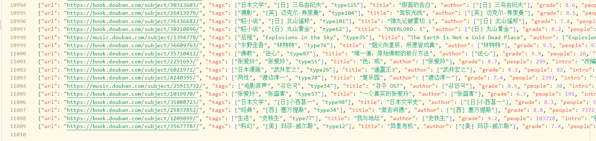
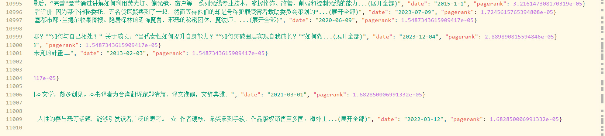
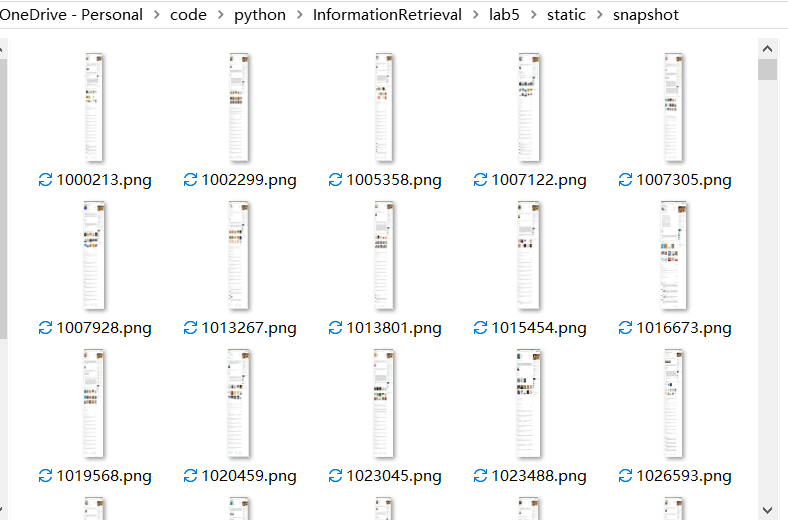
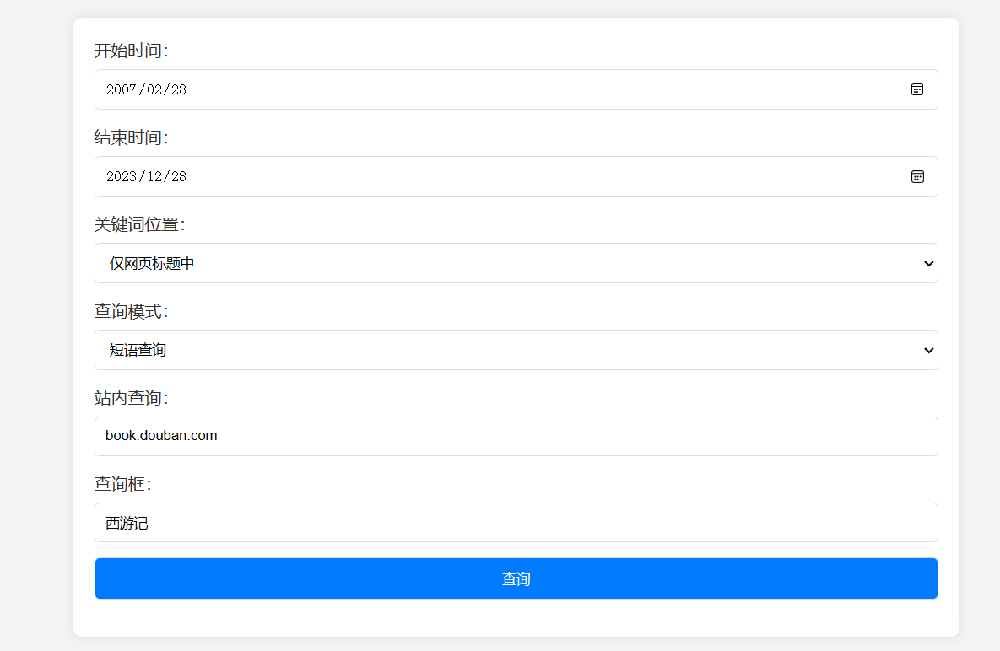
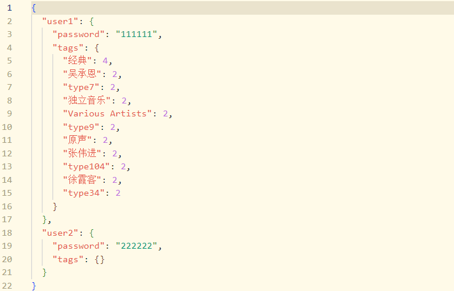
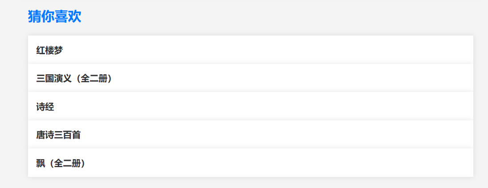
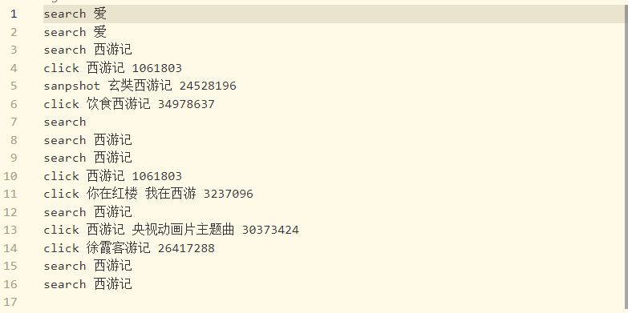
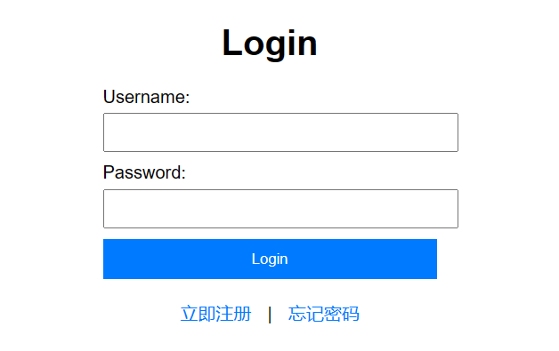
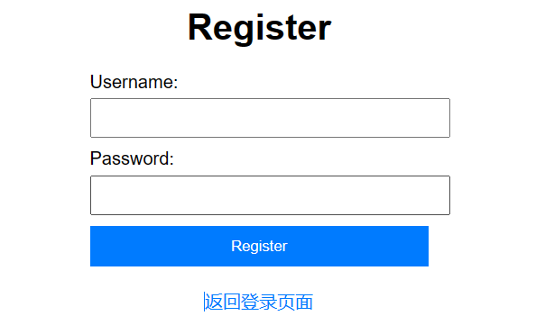
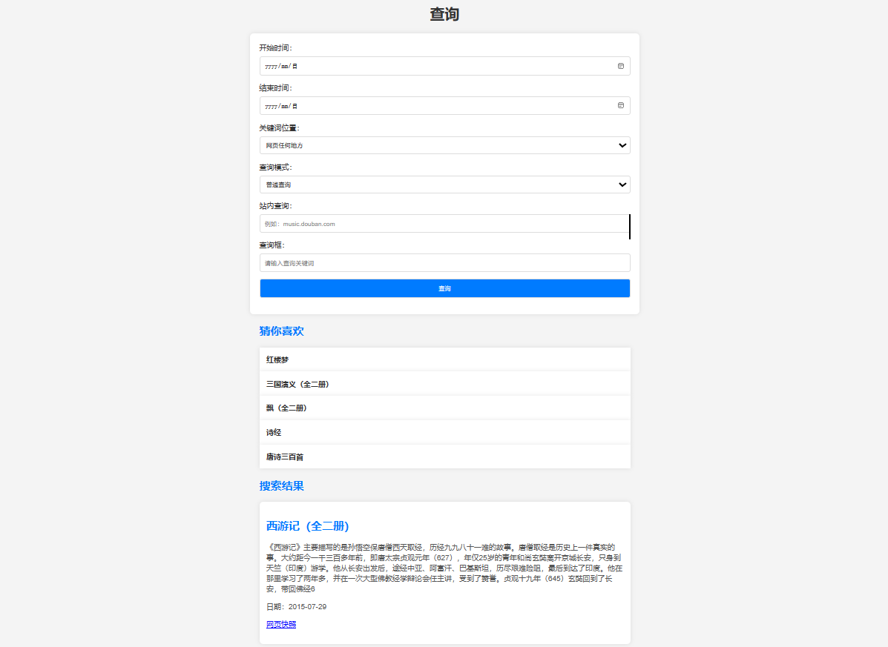

<h1 style="text-align:center;">HW5 Web搜索引擎</h1>

> 姓名：王茂增\
> 学号：2113972\
> 专业：计算机科学与技术\
> 代码：https://github.com/mzwangg/InformationRetrieval

## 整体介绍

- **并行爬虫**：使用requests爬取豆瓣网站的音乐和书籍部分，并使用concurrent进行**并行爬取**，然后使用BeautifulSoup进行解析，得到**标题、作者、评分、评分人数、简介、日期、标签和关联链接**等信息，共爬取了11009个网页

- **链接分析**：使用networkx进行**链接分析**。

- **构建标签**：使用网页标签、作者、**Kmeans聚类类别**作为标签，以实现个性化查询及推荐

- **构建索引**：使用ik_smart进行**分词**，使用elasticsearch**构建索引**。

- **网页快照**：使用**selenium**爬取并保存网页快照，并使用concurrent进行**并行爬取**。

- **查询服务**：支持**站内查询、短语查询、通配查询、查询⽇志、⽹⻚快照**等查询服务，并增加了**按时间查询、正则表达式查询、指定搜索字段**等功能，

- **个性化查询**：实现了一个**账户登录系统**，根据用户的点击行为生成**用户的特征向量**，根据**用户特征**，并结合**与搜索的相关性、网页评分、网页评分人数、PageRank**改进结果的顺序。
  
- **个性化推荐**：根据**用户的特征向量、网页的标签**，并结合**与搜索的相关性、网页评分、网页评分人数、PageRank**对结果进行排序，并选取前五个进行推荐。
  
- **web页面**：使用**flask**编写了一个简单的网站进行展示。

## 项目结构

- root
  
  - static

    - snapshot------------------------------网页快照文件夹

    - log--------------------------------------日志文件夹

    - data.json------------------------------爬取数据

    - user.json------------------------------用户数据

  - templates

    - login.html-----------------------------登录页面

    - register.html--------------------------注册页面

    - search.html---------------------------搜索页面

    - show_webpage.html---------------显示网页页面

    - show_snapshot.html---------------网页快照页面

  - app.py---------------------------------------flask

  - log.py----------------------------------------写入日志

  - process.py ---------------------------------构建索引、爬取网页快照

  - search.py-----------------------------------搜索及推荐

  - spider.py------------------------------------爬虫、链接分析、标签生成

## 1.网页爬取

### (1)、标签页爬取

我选择[豆瓣读书](https://book.douban.com/tag/)和[豆瓣音乐](https://music.douban.com/tag/)网站的**标签页**开始进行爬取，这样就能得到每个图书和音乐的标签，主要代码如下：

首先查找所有符合条件的<td>元素，然后提取其中的url。并对每一个url，通过指定不同的start参数构造目录页网页每个标签构造前面的`LIST_PAGE_NUM`页，最后保存在`list_url_list`中并返回。

```python
# 查找所有符合条件的<td>元素
td_elements = soup.find_all('td')

# 提取URL并保存到列表中
origin_list_url_list = []
for td_element in td_elements:
    a_element = td_element.find('a')
    if a_element and 'href' in a_element.attrs:
        url = tag_url[:-5] + a_element['href']
        origin_list_url_list.append(url)

# 添加不同的页数
for origin_url in origin_list_url_list:
    temp_url = origin_url + '?start={}&type=T'
    for i in range(LIST_PAGE_NUM):
        url = temp_url.format(i * 20)
        list_url_list.append(url)
```

### (2)、目录页爬取

在目录页中，我们需要解析得到详情页的url，由于豆瓣读书和豆瓣音乐的网页格式并不一致，所以分别进行处理，豆瓣读书通过`soup.select('ul.subject-list li.subject-item div.pic a.nbg')`找到uel，豆瓣音乐通过`soup.find_all('a', class_='nbg')`找到url，最后构造一个(tag,url)的元组列表，以记录每一个详情页url的标签。

```python
if list_url.split('/')[2] == "book.douban.com":
    link_elements = soup.select('ul.subject-list li.subject-item div.pic a.nbg')
else:
    link_elements = soup.find_all('a', class_='nbg')

tags = list_url.split('?')[0].split('/')[-1]
links = [(tags, link['href']) for link in link_elements]
```

### (3)、详情页爬取

在详情页中，我们解析网页得到标题、作者、评分、评分人数、简介、日期、标签和关联链接等信息，下面仅以作者进行举例，详见代码：

首先在豆瓣音乐和豆瓣读书中，作者的名字并不一致，豆瓣读书叫作者，而豆瓣音乐叫表演者，所以我们要根据url的类型选择正确的text，然后查找含有这个test的span，提取名字并按"/"进行划分，因为可能有多个作者，并在页面的标签中添加作者，也作为标签。

```python
# 作者
text = '作者' if type == 'book' else '表演者'
author_span = soup.select_one(f'div#info span.pl:contains({text})')
if author_span:
    data['author'] = author_span.find_next('a').text.strip().replace('\n', '').split('/')
    data['tags'] += data['author']
else:
    return None
```

### (4)、其他细节

在爬虫的过程中，我使用fake_useragent随机选取user-agent信息，并使用sleep随机休眠`MIN_SLEEP_TIME`到`MAX_SLEEP_TIME`秒。另外，我还使用了ThreadPoolExecutor进行并行爬取，以加快爬取的速度。

```python
# 随机的user-agent信息
ua = UserAgent()
headers = { 'User-Agent':ua.random}
...
# 随机休眠
time.sleep(random.uniform(MIN_SLEEP_TIME, MAX_SLEEP_TIME))
...
# 并行爬取
  with ThreadPoolExecutor(max_workers=max_workers) as executor:
      results = list(tqdm(executor.map(process_detail_url, detail_url_list), total=len(detail_url_list), desc="Processing details"))
```

## 2.标签生成

### (1)、Silhouette分数

Silhouette分数是一种用于评估聚类效果的指标，它考虑了聚类内部的紧密度和聚类之间的分离度，其计算公式如下：

对于样本i，它所在聚类的平均距离记为a(i)，样本i到其他聚类的平均最短距离记为b(i)，则样本i的Silhouette分数为：

$$ s(i) = \frac{b(i) - a(i)}{\max\{a(i), b(i)\}} $$

对于整个数据集，Silhouette分数是所有样本Silhouette系数的平均值：

$$ S = \frac{1}{N} \sum_{i=1}^{N} s(i) $$

其中，
- $ N $ 是样本的总数；
- $ a(i) $ 是样本i到同一聚类内其他点的平均距离；
- $ b(i) $ 是样本i到其他聚类中所有点的平均最短距离。

Silhouette分数越高，表示聚类效果越好。在聚类算法中，通常选择具有最大Silhouette分数的聚类数目作为最优的聚类数目。

### (2)、进行聚类

下述代码实现了一个文本聚类和标签添加的功能。首先，通过加载中文停用词，使用结巴分词对输入的文本进行预处理。然后，使用TF-IDF向量化文本，并通过KMeans算法，根据Silhouette分数，先以大步长寻找最优聚类个数，再小步长寻找，实现**自动选择最优的聚类数目**。最后，将聚类结果添加到原始的json数据列表中，并返回带有聚类标签的json数据列表。

```python
# 定义一个函数用于加载中文停用词，输入参数是停用词文件的路径
def load_stopwords(file_path):
    with open(file_path, 'r', encoding='utf-8') as file:
        # 读取文件中的停用词，并去除每行两端的空格和换行符
        stopwords = [line.strip() for line in file]
    return stopwords

# 定义一个函数用于对文本进行预处理，包括中文分词
def preprocess_text(text):
    # 使用结巴分词对文本进行中文分词
    words = jieba.cut(text)
    # 将分词结果拼接成一个字符串并返回
    return ' '.join(words)

# 定义一个函数用于对文本进行聚类和标签添加
def cluster_and_label(json_list, stopwords_path=stopwords_psth):
    # 加载中文停用词
    stopwords = load_stopwords(stopwords_path)

    # 提取每个json数据的标题和简介，进行中文分词
    texts = [preprocess_text(item.get('title', '') + "\n" + item.get('intro', '')) for item in json_list]

    # 使用TF-IDF向量化文本
    vectorizer = TfidfVectorizer(stop_words=stopwords)
    X = vectorizer.fit_transform(texts)

    # 自动选择聚类数目
    best_score = -1
    best_k = 0

    # 在指定范围内以步长为CLUSER_STRIDE进行聚类数目的搜索
    for k in range(CLUSER_MIN_NUM, CLUSER_MAX_NUM + 1, CLUSER_STRIDE):  
        kmeans = KMeans(n_clusters=k, random_state=42)
        kmeans.fit(X)
        labels = kmeans.labels_
        score = silhouette_score(X, labels)

        # 更新最优聚类数和对应的Silhouette分数
        if score > best_score:
            best_score = score
            best_k = k

    # 在最优聚类数的左右CLUSER_STRIDE个数再进行搜索
    for k in range(best_k - CLUSER_STRIDE + 1, best_k + CLUSER_STRIDE):
        kmeans = KMeans(n_clusters=k, random_state=42)
        kmeans.fit(X)
        labels = kmeans.labels_
        score = silhouette_score(X, labels)

        # 更新最优聚类数和对应的Silhouette分数
        if score > best_score:
            best_score = score
            best_k = k
    
    # 打印最优聚类数
    print("best_k:", best_k)

    # 使用最佳聚类数目进行聚类
    kmeans = KMeans(n_clusters=best_k, random_state=42)
    kmeans.fit(X)
    labels = kmeans.labels_

    # 为每个聚类添加标签
    for item, label in zip(json_list, labels):
        item["tags"].append(f'type{label+1}')

    # 返回带有聚类标签的json数据列表
    return json_list
```

### (3)、结果展示

最终爬取了11009条数据，并生成标签，得到最佳聚类数为148， `data.json`文件如下所示：



## 3.链接分析

### (1)、代码实现

在链接分析中，我们爬取的json数据作为输入，由于data['link']记录了当前页面引用的页面，所以对于每一条数据，我们遍历data['link']，增加一条link向当前url的边，然后删除link属性。之后则可以调用函数计算pagerank，最后将 pagerank 添加到数据中。

```python
def calculate_pagerank(json_list):
    # 创建有向图
    G = nx.DiGraph()

    # 添加节点和边，不会添加重复的节点和边
    for data in json_list:
        url = data['url']
        G.add_node(url)
        for related_url in data.get('link', []):
            G.add_edge(url, related_url)
        data.pop('link')

    # 计算 pagerank
    pageranks = nx.pagerank(G)

    # 将 pagerank 添加到数据中
    for data in json_list:
        url = data['url']
        data['pagerank'] = pageranks.get(url, 0.0)
    
    return json_list
```

### (2)、结果展示



## 3.索引构建

本文使用ElasticSearch构建索引，下面是具体的介绍：

### 索引配置

下面首先配置一个自定义的文本分析器，该分析器使用了 IK Analyzer 进行中文分词，并应用了自定义的 Ngram 过滤器。实现了中文搜索，并支持 Ngram 类型的模糊搜索。

1. **"index"**: 用于配置索引的一般设置。在这里，"number_of_replicas" 被设置为 2，表示索引的每个分片都有两个副本。

2. **"analysis"**: 这里配置了索引的文本分析相关的设置。

   - **"filter"**: 该部分定义了分析器要用到的一些过滤器（filter）。在这里，有两个过滤器：

     - **"ik_stopword"**: 使用 IK Analyzer 内置的中文停用词表进行停用词过滤。类型为 "stop"，表示停用词过滤器。

     - **"ngram_filter"**: 使用了边缘 Ngram 过滤器，该过滤器用于生成文本的 Ngram 片段。具体配置包括最小片段长度（min_gram）和最大片段长度（max_gram），分别设置为 2 和 15。

   - **"analyzer"**: 定义了自定义分析器。

     - **"ngram_analyzer"**: 自定义分析器的名称。

       - **"type"**: 分析器类型，这里设置为 "custom"。

       - **"tokenizer"**: 指定分析器使用的分词器（tokenizer）。在这里，使用了 IK Analyzer 的 "ik_smart" 分词器。

       - **"filter"**: 定义应用于分析器的过滤器列表。在这里，包括 "lowercase" 表示转换为小写，以及 "ngram_filter" 表示应用上面定义的 "ngram_filter" 过滤器。

```python
settings = {
    "index": {"number_of_replicas": 2},
    "analysis": {
        "filter": {
            "ik_stopword": {
                "type": "stop",
                "stopwords": "_chinese_"
            },
            "ngram_filter": {
                "type": "edge_ngram",
                "min_gram": 2,
                "max_gram": 15,
            }
        },
        "analyzer": {
            "ngram_analyzer": {
                "type": "custom",
                "tokenizer": "ik_smart",
                "filter": ["lowercase", "ngram_filter"],
            }
        }
    }
}
```

### 索引字段

下面对Elasticsearch 的索引映射（Index Mapping）进行配置，用于定义索引中文档的字段及其数据类型。

1. **Text 类型字段**:

    - **"url"**: 表示 URL 的字段。

    - **"title"**: 表示标题的字段。

    - **"intro"**: 表示简介的字段。

   - **解释**:

        - **'type': 'text'**: 表示这些字段包含长文本数据，适合进行全文搜索。对于简介、标题等需要进行全文搜索的字段，使用 "text" 类型是合适的。

2. **Keyword 类型字段**:
    - **"author"**: 表示作者的字段。

    - **"tags"**: 表示标签的字段。

   - **解释**:
  
     - **'type': 'keyword'**: 表示这些字段包含短文本数据，适合进行精确匹配和聚合。对于 "author" 和 "tags" 等具有离散值的字段，使用 "keyword" 类型是合适的。

3. **Date 类型字段**:
   
    - **"date"**: 表示日期的字段。

   - **解释**:

        - **'type': 'date'**: 表示这个字段包含日期类型的数据。Elasticsearch 可以更好地处理日期类型的字段，支持日期范围查询和聚合等操作。

4. **Float 类型字段**:

    - **"grade"**: 表示评分的字段。

    - **"pagerank"**: 表示pagerank的字段。

5. **Integer 类型字段**:

    - **"people"**: 表示评分人数的字段。

这个映射定义了每个字段的数据类型，有助于 Elasticsearch 对文档进行正确的索引和搜索。不同类型的字段支持不同的检索和排序方式，以满足不同的查询需求。

```python
mappings = {
    "properties": {
        "url": {
            'type': 'text'
        },
        "title": {
            'type': 'text'
        },
        "author": {
            'type': 'keyword'
        },
        "date":{
            'type': 'date'
        },
        "grade": {
            'type': 'float'
        },
        "people": {
            'type': 'integer'
        },
        "intro": {
            'type': 'text'
        },
        "tags": {
            'type': 'keyword'
        },
        "pagerank": {
            'type': 'float'
        }
    }
}
```

### 插入数据

`insert_data`用于将大量数据批量插入到Elasticsearch索引中。它通过遍历数据列表，按照指定的批量大小构建批量插入动作，并使用Elasticsearch提供的批量插入API将数据一次性插入到指定索引。具体实现见代码及注释：

函数中的`datetime.strptime(data["date"], '%Y-%m-%d').date()`用于将日期字符串转换为日期对象，而`es.indices.refresh(index=index_name)`则用于立即刷新索引，确保插入的数据即时生效。

```python
def insert_data(data_list, index_name):
    # 定义 Elasticsearch 批量插入的动作列表
    ACTIONS = []

    # 遍历数据列表，按批次进行插入
    for begin in range(0, len(data_list), BULK_NUM):
        for i in range(begin, min(begin + BULK_NUM, len(data_list))):
            data = data_list[i]

            # 构造单条数据的插入动作
            action = {
                "_index": index_name,
                "_source": {
                    "url": data["url"],
                    "title": data["title"],
                    "author": data["author"],
                    "date": datetime.strptime(data["date"], '%Y-%m-%d').date(),
                    "grade": data["grade"],
                    "people": data["people"],
                    "intro": data["intro"],
                    "tags": data["tags"],
                    "pagerank": data["pagerank"]
                }
            }
            # 将单条动作添加到批量插入列表
            ACTIONS.append(action)
        
        # 使用 Elasticsearch 批量插入 API 插入数据，并清空动作列表
        bulk(es, ACTIONS, index=index_name, raise_on_error=True)
        ACTIONS.clear()
        
    # 刷新索引，确保数据立即可用
    es.indices.refresh(index=index_name)
```

## 4.网页快照

### (1)、爬取数据

`get_save_snapshot`用于在多线程环境下通过Selenium截取网页快照。其中，通过线程池`ThreadPoolExecutor`并行执行多个网页截图任务，每个任务在内部通过Selenium模拟浏览器操作，访问网页并保存截图。函数中的重试机制和随机休眠时间增加了程序的健壮性，确保在一些异常情况下仍能成功获取网页快照。具体实现见代码及注释：

```python
def get_save_snapshot(spider_data_list):
    # 定义在线程中执行的截图函数
    def get_save_snapshot_thread(data):
        try:
            # 重试最大次数
            for i in range(1, MAX_REPEAT_NUM + 1):
                # 随机休眠0.5-1秒
                time.sleep(random.uniform(0.5, 1))
                
                # 获取URL和保存图片名
                url = data['url']
                saveImgName = url.split('/')[-2]

                # 配置无界面浏览器驱动
                options = webdriver.EdgeOptions()
                options.add_argument('--headless')
                driver = webdriver.Edge(options=options)
                driver.maximize_window()

                # 返回网页的高度的JS代码
                driver.get(url)

                # 若不是最后一次重试并且不是正确的页面，则继续下一次重试
                if(i != MAX_REPEAT_NUM and driver.current_url != url):
                    continue

                # 获取网页高度和宽度，设置浏览器窗口大小
                scroll_width = driver.execute_script('return document.body.parentNode.scrollWidth')
                scroll_height = driver.execute_script('return document.body.parentNode.scrollHeight')
                driver.set_window_size(scroll_width, scroll_height)

                # 保存截图
                driver.save_screenshot(snapshot_path + os.sep + saveImgName + ".png")
        except:
            return
    
    # 使用线程池执行截图任务
    with ThreadPoolExecutor(max_workers=SNAPSHOT_MAX_WORKERS) as executor:
        list(tqdm(executor.map(get_save_snapshot_thread, spider_data_list), total=len(spider_data_list), desc="Get Save Snapshot"))
```

### (2)、结果展示



## 5.高级查询

### (1)、评分脚本

下列脚本是用于Elasticsearch的脚本评分功能，根据**文档的相关性、评分、人数、PageRank以及用户的兴趣得分**对文档进行排序，用于优化查询结果，并实现**个性化查询**，具体解释如下：

- `interestsScore` 初始化为1.0，用于记录用户对搜索结果的兴趣得分。通过遍历文档的`tags`字段，检查每个标签是否包含在用户兴趣中。如果是，则根据用户兴趣中的权重进行加分，权重乘以0.1。
  
- 进行防御性检查，确保评分不为零或负数。使用`Math.max`函数，将评分限制为不小于1。
  
- 计算`grade`，即文档的评分，乘以0.1。
  
- 计算`peopleLog`，即文档的人数的对数（防止人数为零）。使用`Math.log`函数。
  
- 计算`pagerank`，即文档的PageRank，乘以0.1。
  
- 返回最终评分，将所有因素考虑在内，包括文档的评分、人数、PageRank以及用户的兴趣得分。

```python
script_source = """
    double interestsScore = 1.0;
    for (tag in doc['tags']) {
        // 如果用户兴趣中包含当前标签，增加兴趣得分
        if (params.userInterests.containsKey(tag)) {
            interestsScore += params.userInterests[tag] * 0.1;
        }
    }
    
    // 防御性检查，避免零或负数
    double grade = Math.max(doc['grade'].value, 1) * 0.1;  // 避免零
    double peopleLog = Math.log(doc['people'].value + 1); // 避免零
    double pagerank = Math.max(doc['pagerank'].value, 1);  // 避免零

    // 返回最终评分，考虑兴趣、评分、人数、PageRank等因素
    return _score * interestsScore * grade * peopleLog * pagerank;
"""
```

### (2)、查询函数

`my_search`实现了基于Elasticsearch的高级搜索功能。通过使用elasticsearch_dsl库，构建了包括时间范围、域名、字段、搜索模式和用户兴趣等多个条件的复杂查询。支持**站内查询、短语查询、通配查询**等查询服务，并增加了**按时间查询、正则表达式查询、指定搜索字段**等功能，并根据输入的`user_interests`实现个性化查询，`user_interests`的生成将在[个性化查询](#6个性化查询)部分进行介绍。

另外，通过上面的脚本对搜索结果进行了自定义评分，考虑了用户兴趣、与搜索的相关性、网页评分、网页评分人数、PageRank等多个因素，以提高搜索结果的准确率和召回率。函数最终返回符合条件的排好序的搜索结果列表。

具体实现流程如下：

1. **初始化Elasticsearch客户端和查询语句：**
   
   - 使用`Elasticsearch`类初始化一个Elasticsearch客户端，指定连接的地址和端口。

   - 使用`Search`类构建Elasticsearch查询对象，指定索引名称为'douban_index'，并设置查询结果的最大数量为100。

2. **构建时间范围查询：**
   
   - 根据传入的`time_begin`和`time_end`参数，通过`filter`方法构建时间范围查询条件，限制搜索结果在指定时间范围内。

3. **构建站内查询：**
   
   - 如果传入了`web`参数，则通过`filter`方法构建正则表达式查询条件，匹配包含指定域名的URL。

4. **选择查询类型：**
   
   - 根据传入的`pattern`参数选择查询类型，支持'match'（默认）、'regexp'、'wildcard'和'phrase'四种查询类型。

5. **构建查询字段范围：**
   
   - 根据传入的`domain`参数选择查询字段，支持'title'、'intro'、'author'和'all'四种域，分别为仅查询标题、仅查询简介、仅查询作者和全部查询，通过`Q`类构建查询条件。

6. **搜索及处理：**
   
   - 使用`execute`方法执行构建好的查询，获取Elasticsearch的搜索结果。

   - 遍历搜索结果，将每个文档的相关信息以字典形式添加到`search_results`列表中。

    - 最终返回包含搜索结果的列表`search_results`。

通过这一系列步骤，代码实现了一个灵活且功能强大的Elasticsearch搜索功能，支持多条件、自定义评分和高级查询。

```python
def my_search(time_begin=None, time_end=None, web='', domain='all', pattern=0, user_interests ={}, querys=[]):
    # 初始化 Elasticsearch 客户端
    es = Elasticsearch("http://localhost:9200")

    # 构建 Elasticsearch 的查询语句
    s = Search(using=es, index='douban_index')
    s = s.extra(size=100)

    # 构建时间范围查询，实现指定时间范围的搜索
    if time_begin is not None:
        s = s.filter('range', date={'gte': time_begin})
    if time_end is not None:
        s = s.filter('range', date={'lte': time_end})

    # 构建包含域名的查询，实现站内查询
    if web:
        s = s.filter('regexp', url=f'.*{web}.*')

    # 根据pattern选择搜索的模式
    search_type = 'match'
    if pattern == "regexp":
        search_type = 'regexp'
    elif pattern == "wildcard":
        search_type = 'wildcard'
    elif pattern == "phrase":
        search_type = 'match_phrase'

    # 构建domain，在对应字段范围进行查询
    if domain == 'title':
        must_queries = [Q(search_type, title=query) for query in querys]
    elif domain == 'intro':
        must_queries = [Q(search_type, intro=query) for query in querys]
    elif domain == 'author':
        must_queries = [Q(search_type, author=query) for query in querys]
    else:
        must_queries = [Q(search_type, title=query) | 
                        Q(search_type, intro=query) |
                        Q(search_type, author=query) for query in querys]
    bool_query = Q('bool', must=must_queries)
    
    # 使用elasticsearch_dsl构建查询
    script_score = SF('script_score', script={"source": script_source, "params": {"userInterests": user_interests}})
    s = s.query(Q('function_score', query=bool_query, functions=[script_score]))

    # 执行搜索
    response = s.execute()

    # 处理搜索结果
    search_results = []
    for hit in response:
        search_results.append(hit.to_dict())

    return search_results
```

### (3)、结果展示

对于搜索，我指定开始时间为2007/02/28，结束时间为2023/12/28，查找标题，使用短语查询，并在book.douban.com网站进行查找，查找词为西游记。



可以看到查找结果中，标题均包含"西游记"这个短语，时间也在2007/02/28到2023/12/28之间，搜索结果均在book.douban.com站中。


## 6.个性化查询

个性化查询的查询部分已经在[高级查询](#5高级查询)中介绍，下面介绍如何生成`user_interests`。

### (1)、用户注册功能

`register`实现了注册功能。当用户通过POST请求提交用户名和密码时，它从表单中获取这些信息，然后将用户信息存入用户数据字典中，包括用户名、密码和一个空的标签(tags)字典。然后将更新后的用户数据写入存储，并重定向到登录页面。如果是GET请求访问注册页面，将渲染注册页面的模板供用户填写。

```python
# 注册页面路由
@app.route('/register', methods=['GET', 'POST'])
def register():
    # 处理POST请求
    if request.method == 'POST':
        # 获取表单提交的用户名和密码
        username = request.form['username']
        password = request.form['password']
        
        # 读取已注册用户数据，并将用户名、密码存入用户字典，然后保存
        users = read_users()
        users[username] = {'password': password, 'tags': {}}
        write_users(users)
        
        # 注册成功后重定向到登录页面
        return redirect(url_for('login'))

    # 渲染注册页面模板（register.html）
    return render_template('register.html')
```

### (2)、用户登录功能

`login`使用Flask的session实现了登录功能。当用户通过POST请求提交用户名和密码时，它从表单中获取这些信息，然后检查它们是否与预先存储的用户数据匹配。如果匹配成功，将用户的用户名存入session中，然后重定向到搜索页面。如果用户名或密码不匹配，或者是GET请求访问登录页面，将渲染登录页面的模板供用户填写。

```python
# 登录页面路由
@app.route('/', methods=['GET', 'POST'])
def login():
    # 处理POST请求
    if request.method == 'POST':
        # 获取表单提交的用户名和密码
        username = request.form['username']
        password = request.form['password']
        
        # 读取用户信息（这里假设read_users()是一个函数用于读取用户数据）
        users = read_users()
        
        # 检查用户名和密码是否匹配
        # 如果匹配，将用户名存入会话(session)中， 然后重定向到搜索页面
        if username in users and users[username]['password'] == password:
            session['username'] = username
            return redirect(url_for('search'))

    # 渲染登录页面模板（login.html）
    return render_template('login.html')
```

### (3)、更新用户标签

在用户点击网页或者查看网页快照时，将根据网页的标签更新用户的标签，将这作为`user_interests`输入[高级查询](#5高级查询)中介绍的搜索函数，实现个性化推荐。

首先定义了一个Flask路由'/process-url'，接受POST请求。在处理过程中，从请求中获取JSON数据，提取URL，根据session得到用户名，并根据用户的点击行为更新用户的标签信息。然后，将用户的点击行为记录到日志中。最后，返回一个渲染模板的响应，用于展示网页内容。异常情况下，返回一个包含错误信息的JSON响应。

```python
@app.route('/process-url', methods=['POST'])
def process_url():
    try:
        # 从请求中获取JSON数据
        data = request.get_json()
        url = data.get('url')

        # 读取用户数据
        users = read_users()
        tags = users[session['username']]['tags']

        # 从URL中提取索引号
        index = url.split('/')[-2]

        # 更新用户标签信息
        for item in index_tag_dict[index]:
            if item in tags:
                tags[item] += 2
            else:
                tags[item] = 2
        write_users(users)

        # 记录用户行为到日志
        write_log(session['username'], 'click ' + index_title_dict[index] + ' ' + index)

        # 返回一个渲染模板的响应，展示网页内容
        return render_template('show_webpage.html', url=url)
    except Exception as e:
        # 处理异常情况，返回JSON格式的错误信息
        return jsonify({'error': str(e)})
```

下面是经过数次点击之后`user.json`可能的结果：



## 7.个性化推荐

个性化推荐部分，本人通过选取前`RECOMMEND_BASE_NUM`个搜索结果，得到它们的标签，然后根据这些标签对所有的数据进行排序，并在没有出现在搜索结果的数据中选取前`RECOMMEND_NUM`个数据作为推荐结果。

### (1)、评分脚本

下列脚本通过遍历文档中的标签，根据标签字典和用户兴趣参数，计算标签分数和兴趣分数，同时进行一些防御性检查，最终将这些因素组合为最终的评分。该脚本的目的是为了综合考虑文档的多个因素，从而实现更精准的搜索结果排序，进行更精确的个性化推荐。

```python
# 构建 Elasticsearch 的脚本评分源码
script_source = """
    // 初始化标签分数为一个小值
    double tagsScore = 0.001;
    
    // 遍历文档中的每个标签
    for (tag in doc['tags']) {
        // 如果标签在参数中的标签字典中，将标签分数加上对应值
        if (params.tags_dict.containsKey(tag)) {
            tagsScore += params.tags_dict[tag];
        }
    }

    // 初始化兴趣分数为1.0
    double interestsScore = 1.0;
    
    // 遍历文档中的每个标签
    for (tag in doc['tags']) {
        // 如果标签在用户兴趣参数中，将兴趣分数加上对应值的0.1倍
        if (params.userInterests.containsKey(tag)) {
            interestsScore += params.userInterests[tag] * 0.1;
        }
    }

    // 防御性检查，避免零或负数
    // 将评分、兴趣分数、评分等因素进行组合，构成最终的评分
    double grade = Math.max(doc['grade'].value, 1) * 0.1;  // 避免零
    double peopleLog = Math.log(doc['people'].value + 1); // 避免零
    double pagerank = Math.max(doc['pagerank'].value, 1);  // 避免零

    // 返回最终的评分
    return _score * interestsScore * grade * peopleLog * pagerank * tagsScore;
"""
```

### (2)、推荐函数

推荐函数`my_recommend`接受搜索结果和用户兴趣作为输入，首先它统计了搜索结果前`RECOMMEND_BASE_NUM`个结果的标签，构建了一个标签字典。接着，通过Elasticsearch进行查询，使用函数得分（script_score）来计算每个文档的推荐度。函数的评分因子包括标签匹配度、用户兴趣匹配度、评分、人数和PageRank等。最后，对查询结果进行处理，去除已经在搜索结果中的文档，并返回推荐列表。

```python
def my_recommend(search_results, user_interests={}):
    # 统计搜索结果中，前RECOMMEND_BASE_NUM歌结果标签的出现次数
    tags_dict = {}
    for search_result in search_results[:RECOMMEND_BASE_NUM]:
        for tag in search_result['tags']:
            if tag in tags_dict:
                tags_dict[tag] += 1
            else:
                tags_dict[tag] = 1
    print(tags_dict)

    # 初始化 Elasticsearch 客户端
    es = Elasticsearch("http://localhost:9200")  # 根据实际情况设置 Elasticsearch 地址和端口

    # 构建 Elasticsearch 的查询语句
    s = Search(using=es, index='douban_index')  # 将 'your_index_name' 替换为你的索引名称
    s = s.extra(size=100)

    # 构建 Elasticsearch 的脚本评分
    script_score = SF('script_score', script={"source": script_source, "params": {"userInterests": user_interests, "tags_dict": tags_dict}})
    q = Q("wildcard", title="*") | Q("wildcard", intro="*") | Q("wildcard", author="*")
    s = s.query(Q('function_score', query=q, functions=[script_score]))

    # 执行搜索
    response = s.execute()

    # 处理搜索结果，如果没在搜索结果中，则放在推荐结果中
    recommend_results = []
    for hit in response:
        hit_dict = hit.to_dict()
        if hit_dict not in search_results:
            recommend_results.append(hit_dict)

    # 返回前 RECOMMEND_NUM 个推荐结果
    return recommend_results[:RECOMMEND_NUM]
```

### （3）结果展示

搜索《西游记》，得到推荐结果如下：



可以看到，推荐系统推荐了与西游记同属于`四大名著`的《红楼梦》和《三国演义》，以及同为`古典文学`的《诗经》、《唐诗三百首》等。

## 8.搜索日志

### (1)、写入日志函数

下列代码实现了用户行为日志的写入功能，即将用户的操作日志记录到相应的用户日志文件中。首先，检查指定用户的日志文件是否存在，若不存在则创建一个空文件。然后，将新的日志信息追加写入到用户的日志文件中，每条日志占据一行。

```python
def write_log(username, log):
    # 检查 log_path 是否存在，不存在则创建
    log_path = log_dir_path + os.sep + f"{username}.txt"
    if not os.path.exists(log_path):
        with open(log_path, 'w', encoding="utf8") as file:
            file.write('')

    # 将 log 写入到文件中
    with open(log_path, 'a', encoding="utf8") as file:
        file.write(log + '\n')
```

### (2)、调用写入日志函数

在搜索、点击页面、点击网页快照时，分别写入不同的日志：

```python
# 搜索时
write_log(session['username'], 'search ' + request.form.get('querys', ''))

# 点击页面时
write_log(session['username'], 'click ' + index_title_dict[index] + ' ' + index)

点击网页快照时
write_log(session['username'], 'sanpshot ' + index_title_dict[snapshotIndex] + ' ' + snapshotIndex)
```

### (3)。结果展示

下面是经过一系列点击后的部分日志：



## 9.web界面

本人实现了一个简单的基于Flask的Web应用，提供用户登录、注册、搜索、推荐、网页快照等功能。具体实现细节包括用户认证、用户信息存储、搜索与推荐功能的调用，以及日志记录等。应用通过Flask的路由管理不同页面，通过模板引擎渲染动态内容。

用户可以通过登录页面输入用户名和密码进行认证，也可以在注册页面注册新用户。用户信息以JSON格式存储，用于认证和记录用户标签信息。成功登录后，用户可以在搜索页面进行搜索，搜索结果会显示相应的网页链接以及推荐结果，用户点击链接后可进入对应网页，并可以查看网页快照，用户行为会被记录到日志文件中。用户的标签信息会被更新，用于后续的搜索和推荐。

### (1) 页面介绍

1. **login.html（登录页面）:**
   
   - 提供用户登录的表单，包括用户名和密码的输入框。

   - 通过POST请求将用户输入的用户名和密码提交给服务器进行认证。

   - 如果认证成功，重定向到搜索页面；否则，保留在登录页面。

    

2. **register.html（注册页面）:**

   - 提供用户注册的表单，包括用户名和密码的输入框。

   - 通过POST请求将用户输入的用户名和密码提交给服务器进行注册。

   - 如果注册成功，重定向到登录页面；否则，保留在注册页面。

    

3. **search.html（搜索页面）:**

   - 需要用户登录后才能访问。

   - 提供搜索条件的表单，包括时间范围、搜索范围、域名、搜索模式、搜索词等。

   - 通过POST请求将用户输入的搜索条件提交给服务器进行搜索。

   - 展示搜索结果和推荐结果，允许用户点击链接并记录用户行为。

   - 用户行为会被记录到日志。

    

4. **show_webpage.html（显示网页页面）:**

   - 在用户点击搜索结果中的链接或者推荐结果后跳转的页面。

   - 展示指定网页的内容。

   - 用户行为会被记录到日志。

    

5. **show_snapshot.html（网页快照页面）:**

   - 在用户点击快照链接后跳转的页面。

   - 展示网页的快照图片。

   - 用户行为会被记录到日志。

   - 用户行为会被记录到日志。

    

### (2)、实现细节

下列JavaScript代码是一个事件处理脚本，通过监听文档加载完成事件 (`DOMContentLoaded`)，在页面加载完毕后执行。它定义了一个处理点击事件的函数 `handleLinkClick`，该函数阻止默认行为（防止跳转到链接的URL），发送一个AJAX请求到服务器（app.py）进行处理，然后根据请求的结果进行页面跳转。

在文档加载完成后，获取所有具有 `.result-link` 类的标题链接元素和所有具有 `.recommend-link` 类的链接元素，并为它们分别添加点击事件监听器，以调用 `handleLinkClick` 函数来处理点击事件，以进行搜索、推荐和更新用户的标签。整体实现了通过异步请求处理链接点击事件，实现了无刷新页面跳转的效果。

```html
<script>
    document.addEventListener('DOMContentLoaded', function () {
        // 定义处理点击事件的函数
        function handleLinkClick(link) {
            link.addEventListener('click', function (event) {
                event.preventDefault(); // 阻止默认行为，即阻止跳转到链接的URL

                var url = link.getAttribute('data-url');

                // 发送AJAX请求将URL发送到app.py进行处理
                var xhr = new XMLHttpRequest();
                xhr.open('POST', '/process-url', true);
                xhr.setRequestHeader('Content-Type', 'application/json');

                xhr.onload = function () {
                    if (xhr.status === 200) {
                        // 在请求成功后，通过JavaScript进行页面跳转
                        window.location.href = url;
                    } else {
                        // 处理请求失败的情况
                        console.error('Error processing URL:', xhr.responseText);
                    }
                };

                xhr.send(JSON.stringify({ url: url }));
            });
        }

        // 获取所有标题链接元素
        var resultLinks = document.querySelectorAll('.result-link');
        var likeItemLinks = document.querySelectorAll('.recommend-link');

        // 为每个标题链接和 .like_item 链接添加点击事件监听器
        resultLinks.forEach(function (link) {
            handleLinkClick(link);
        });

        likeItemLinks.forEach(function (link) {
            handleLinkClick(link);
        });
    });
</script>

```