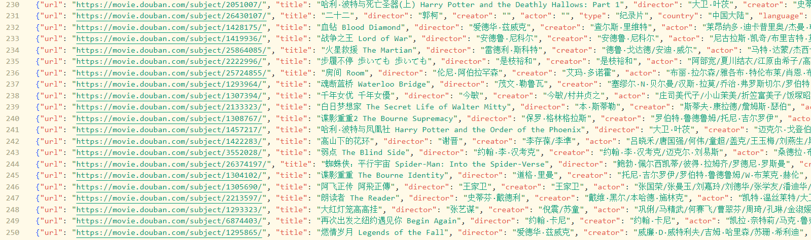
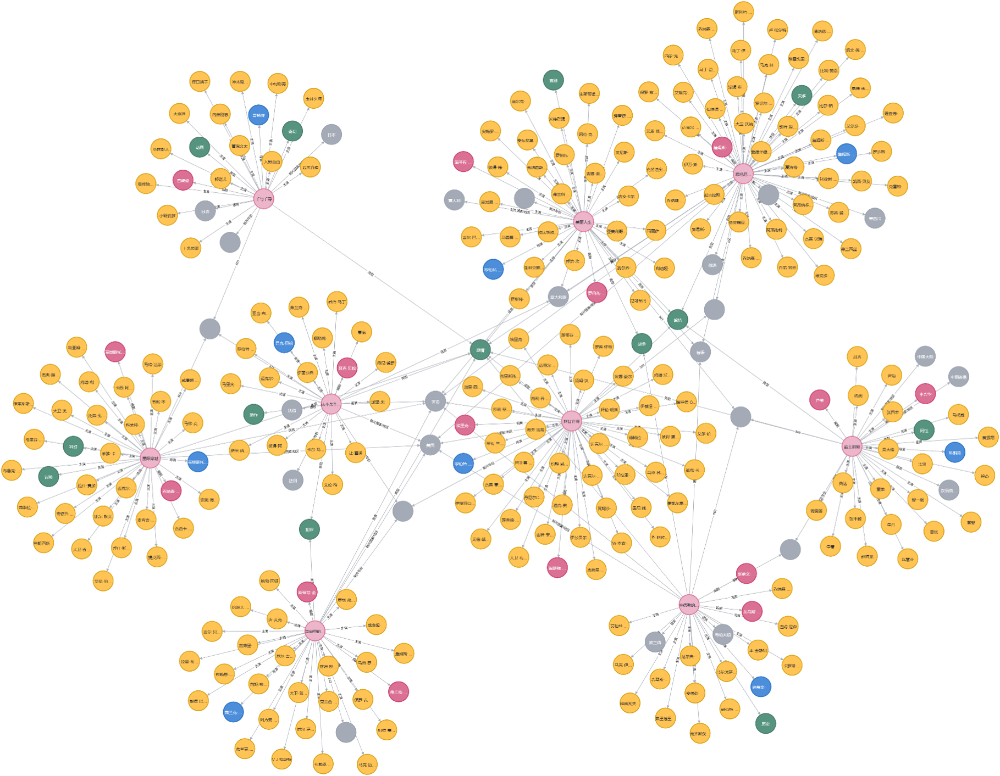
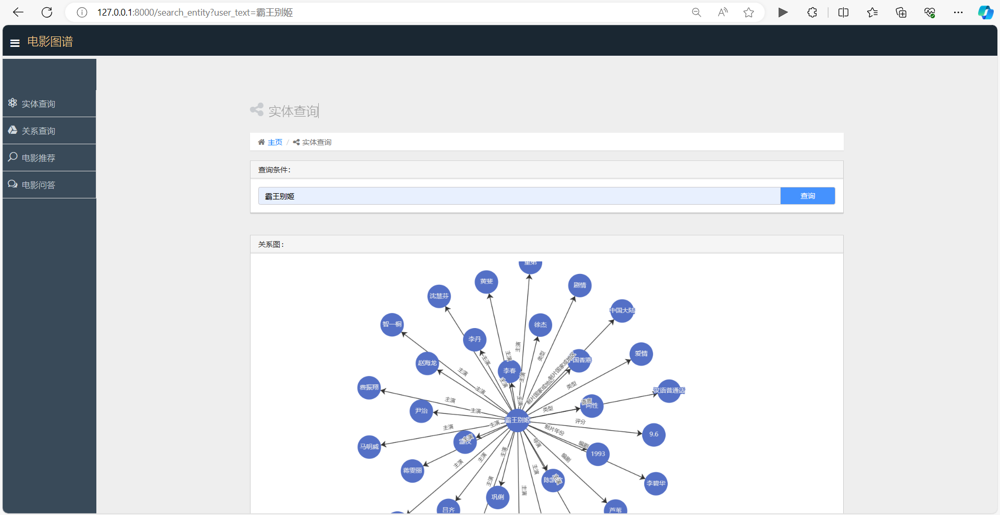
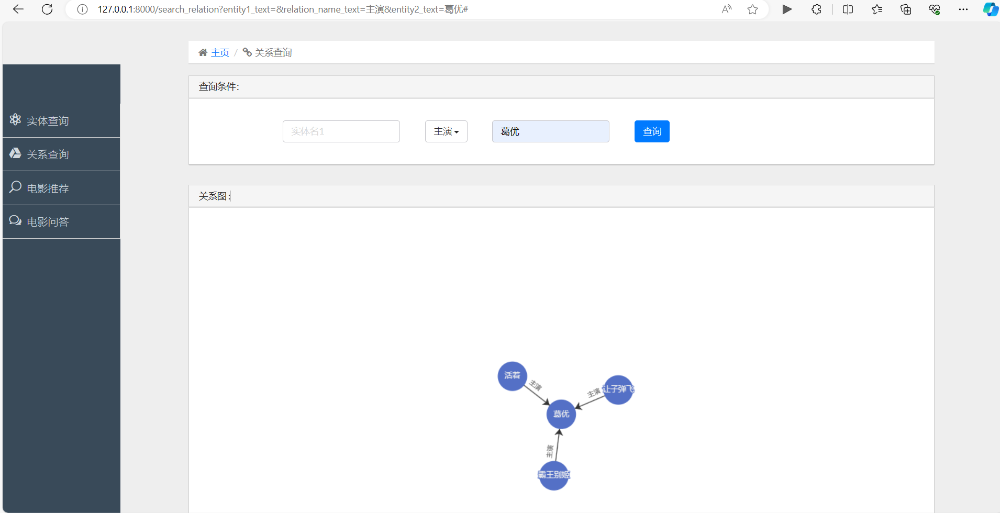
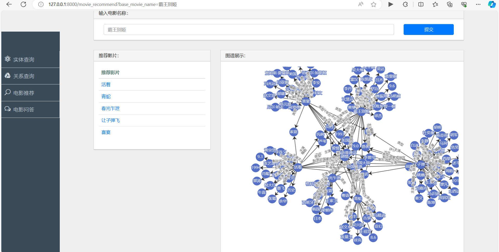
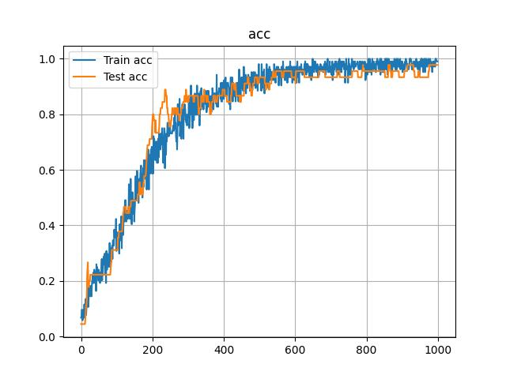
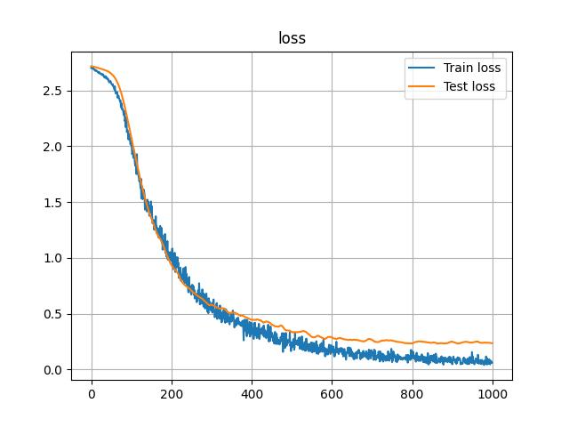
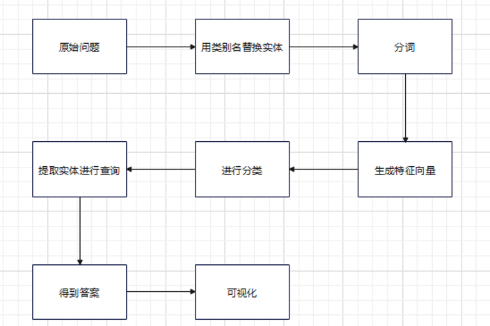
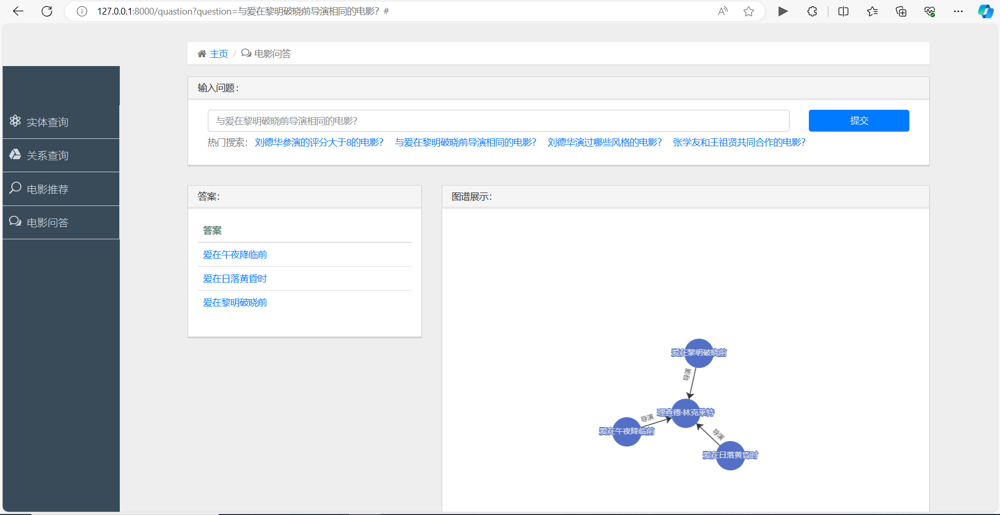

# 基于知识图谱的信息检索、推荐和问答系统

## 1. **背景与意义**

### **背景**

随着信息技术的不断发展，人们在日常生活和工作中产生了大量的数据和信息。在这个信息爆炸的时代，如何高效地获取、组织和利用这些信息成为一个重要的问题。传统的搜索引擎在一定程度上满足了信息检索的需求，但随着用户对个性化、智能化服务的需求增加，传统搜索引擎已经难以满足用户的更精准、深层次的需求。

知识图谱作为一种以图结构组织和表示知识的方式，提供了一种更加丰富、语义明确的知识表达方式。通过构建知识图谱，可以将不同领域的知识以结构化的方式链接起来，为用户提供更加准确、全面的信息服务。基于知识图谱的信息检索、推荐和自然语言问答系统成为解决上述问题的重要途径。

### **意义**

1. **语义理解与准确检索：** 知识图谱通过建模实体之间的关系，能够更好地理解语义关联，使得系统在信息检索时更为准确。用户提出的查询可以更深层次地被理解，而不仅仅是关键词的匹配。

2. **个性化服务与用户体验：** 基于知识图谱的系统可以分析用户的历史行为、兴趣和偏好，提供个性化的推荐和服务。这不仅提高了用户体验，还有助于用户更快速地找到符合其需求的信息。

3. **跨领域应用与交叉创新：** 知识图谱的构建往往涉及多个领域的知识整合，促进了不同领域之间的交叉创新。这有助于推动科技、文化、医疗等领域的跨界发展。

4. **问题解决与决策支持：** 知识图谱为决策者提供了更清晰、全面的信息支持。在企业、政府等组织中，基于知识图谱的信息系统可以帮助进行智能决策，解决复杂问题。

5. **自然语言交互：** 基于知识图谱的自然语言问答系统可以使用户以自然语言的方式与系统进行交互，使得用户可以更直观地获取所需信息，降低了使用门槛。

## 2. **现状分析**

### **知识图谱应用现状**

- **百度百科、维基百科：** 百度百科和维基百科是基于知识图谱构建的在线百科全书，提供了丰富的实体关系和知识链接。

- **谷歌知道：** 谷歌知道是一个基于知识图谱的问答社区，用户可以通过提问和回答来分享和获取知识。

- **电商推荐系统：** 一些电商平台利用知识图谱构建商品之间的关联，提高推荐系统的准确性，例如阿里巴巴的推荐算法。

### **存在的问题**

在浏览器中，虽然支持一些比较简单的自然语言问答，并直接给出了答案，但是不能支持需要深层次检索的问题，如：

搜索“霸王别姬的导演”，谷歌和百度都能直接给出答案：

<center>谷歌搜索结果</center>


<center>百度搜索结果</center>


但是，如果搜索“与霸王别姬导演相同的其他电影”，则均不能给出答案：

<center>谷歌搜索结果</center>


<center>百度搜索结果</center>


这是因为要回答这个问题，需要先检索霸王别姬的导演，再检索该导演的其他电影，需要更加深入的检索，当前搜索引擎还没有添加对该检索的支持。

## 3. **⽅案设计**

本项目决定爬取[豆瓣top250](https://movie.douban.com/top250)网站的相关信息，然后使用neo4j图数据库存储数据，并增加实体查询、关系查询、电影推荐和电影问答四大功能：

1. **爬取数据**：通过requests、lxml、bs4爬取豆瓣电影top250的信息，包括电影名称、导演、编剧、主演、类型、制片国家\地区、语言、上映年份、评分、简介等信息。

2. **导入数据**：设计Neo4j数据库，包括电影，导演、编剧、主演、类型、制片国家\地区、语言、上映年份、评分等实体，并包括导演、编剧、主演、类型、制片国家\地区、语言、上映年份、评分等关系，然后将上述数据导入数据库中。

3. **实体查询**：查找某个实体及其所有的关系，输出结果并进行可视化。
   
4. **关系查询**：可以根据关系类型、起始节点、终止节点进行查找，输出结果并进行可视化。

5. **推荐功能**：实现输入一个电影名称，根据其导演、编剧、主演、类型、制片国家\地区、语言、上映年份等信息的相似程度，再乘以评分，选择出数据库中得分最高的五个电影作为推荐电影，输出结果并进行可视化。

6. **问答功能**：通过输入自然语言得到对应的答案，实现的思路如下：

    1. **选择要支持的问题**。本项目共支持14种问题，包括直接查询类问题，如查询某电影的评分、主演等；条件约束查询类问题，如查询某个演员参演的、评分大于9的电影；满足某条件的统计类问题，如某演员参演的电影总数；多节点查询类问题，如与某部电影导演相同的电影有哪些等。

    2. **分词、词性分析、去掉停用词、转为词向量**。在pyhanlp的词典中加入电影类型.txt、演员名.txt、电影名.txt、other.txt，使用pyhanlp对用于训练的问题进行分词，并将电影名替换为nm，将演员名替换为nnt，将电影类型替换为ng，以不关注具体的数据，而只根据问题的形式进行分类。根据停用词库去掉停用词，将剩下的词组成词袋，每个问题都通过词袋转为词向量。

    3. **训练分类模型**。搭建神经网络，将词向量与标签结合输入神经网络进行训练，首先划分训练集和测试集以验证网络在新数据上的性能，防止过拟合，再使用全部数据进行训练，保存最优结果。

    4. **问答功能实现**。当输入问题并提交之后，使用pyhanlp进行分词，并将电影名替换为nm，将演员名替换为nnt，将电影类型替换为ng，然后生成该问题的词向量，输入网络，得到对应的问题类别。调用该类别对应的处理函数，完成查询。

## 4. **技术路线**

本项目的前端部分参考了项目[Agriculture_KnowledgeGraph](https://github.com/qq547276542/Agriculture_KnowledgeGraph)。

### **项目结构**

- root
  
  - myweb-----------------------------------------django根目录

  - static--------------------------------------------django静态数据文件夹

  - templates--------------------------------------网页模板文件夹

  - util

    - Data---------------------------------------用于训练的数据文件夹

    - Dictionaries------------------------------词典文件夹，用于进行词性分析

    - 1_spider.py-------------------------------爬取数据

    - 2_load_neo4j_data.py-----------------加载neo4j数据

    - 3_process.py----------------------------将问题处理为词向量

    - 4_train.py---------------------------------训练模型

    - feedbackward_netwark.py-----------神经网络

    - preload.py--------------------------------加载数据库、模型、分词器

    - neo4j_models.py-----------------------实现neo4j的查询

### **爬取数据**

从[豆瓣top250](https://movie.douban.com/top250)爬取数据，共250个电影，提取电影名称、导演、编剧、主演、类型、制片国家\地区、语言、上映年份、评分、简介等信息。下面给出爬取日期的示例代码：

```python
# 获取上映日期
date_element = soup_document.find_all(name='span', property='v:initialReleaseDate')
date = ''
for e in date_element:
    # 剔除空格并拼接日期字符串
    et = e.get_text().strip().replace(' ', '')
    date = date + et + '/'
else:
    date = date[:-1] + ''  # 移除末尾多余的斜杠
p = re.compile('\s+')
date = re.sub(p, '', date)  # 使用正则表达式去除日期字符串中的空格
data['date'] = date
```

这段代码通过 BeautifulSoup 解析 HTML 文档，查找标签属性为 `v:initialReleaseDate` 的 `span` 元素，提取电影的上映日期信息。在提取的过程中，将每个日期字符串去除空格后拼接为一个整体的日期字符串。最后，使用正则表达式去除日期字符串中可能存在的额外空格，并将最终的日期字符串存储在名为 `data['date']` 的字典中，实现了从网页中提取电影上映日期的功能。

得到的`spider_data.json`文件截图如下：



### **导入数据**

设计Neo4j数据库，包括电影，导演、编剧、主演、类型、制片国家\地区、语言、上映年份、评分等实体，并包括导演、编剧、主演、类型、制片国家\地区、语言、上映年份、评分等关系，然后将上述数据导入数据库中。下面给出将日期数据导入neo4j数据库的示例代码：

```python
# 查询节点
def match_node(graph, label, attrs):
    # 构建查询条件，检查节点是否已存在
    n = "_.name=\"" + str(attrs["name"]) + "\""
    matcher = NodeMatcher(graph)
    return matcher.match(label).where(n).first()

# 建立一个节点
def create_node(graph, label, attrs):
    # 查询是否已经存在，若存在则返回节点，否则返回None
    value = match_node(graph, label, attrs)
    # 如果要创建的节点不存在则创建
    if value is None:
        node = Node(label, **attrs)
        n = graph.create(node)
        return n
    return False

# 制片年份节点
year = data.loc[i, 'date']
create_node(graph, "制片年份", {"name": year})  # 创建制片年份节点
year_rel = Relationship(graph.nodes.match(name=film_title).first(),
                        "制片年份",
                        graph.nodes.match("制片年份", name=year).first())
graph.create(year_rel)
```

这段代码是一个用于在 Neo4j 图数据库中查询和创建节点的函数。`match_node` 函数通过传入图数据库、节点标签和属性，查询是否存在符合条件的节点。`create_node` 函数用于创建节点，先通过 `match_node` 检查节点是否已存在，如果不存在则创建新节点。对于导入制片年份，代码首先在数据中读取制片年份，然后创建了一个制片年份节点，并建立了与电影节点的关系。

下面给出十个电影对应的neo4j图数据库关系图，



### **实体查询**

查找某个实体及其所有的关系，输出结果并进行可视化。

```python
# 处理查询结果，将结果转换成 JSON 格式
def process_ans(self, answer, url_value=True):
    json_list = []
    for an in answer:
        result = {}
        rel = an['rel']
        # 获取关系起始节点、关系类型和目标节点的名称
        result["source"] = rel.start_node['name']
        result['rel_type'] = list(rel.types())[0]
        result['target'] = rel.end_node['name']
        # 如果需要包含 URL，则获取关系起始节点的 URL
        if url_value:
            result['url'] = rel.start_node['url']
        json_list.append(result)

    return json_list

# 根据实体名称进行查询，获取与该实体相关的信息
def get_entity_info(self, name) -> list:
    # 执行 Cypher 查询语句，根据实体名称匹配相关的关系
    answer = self.graph.run(
        "MATCH (source)-[rel]-(target) WHERE source.name = $name " +
        "RETURN rel ", name=name).data()
    # 调用 process_ans 处理查询结果，返回 JSON 格式数据
    return self.process_ans(answer)
```

`process_ans` 函数用于处理查询结果，将结果转换成 JSON 格式，提取了关系的起始节点、关系类型和目标节点的名称，并可以选择是否包含 URL。`get_entity_info` 函数执行 Cypher 查询语句，根据实体名称匹配相关的关系，最后调用 `process_ans` 处理查询结果，返回 JSON 格式数据。这实现了通过实体名称查询图数据库中相关信息的功能。

搜索霸王别姬，在前端对结果进行了可视化，结果如下：



### **关系查询**

可以根据关系类型、起始节点、终止节点进行查找，输出结果并进行可视化。

```python
# 关系查询：实体1
def find_relation_by_entity1(self, entity1):
    # 使用Cypher查询语言在图数据库中查找与给定实体1名称相关的关系
    answer = self.graph.run(
        "MATCH (source)-[rel]-(target)  WHERE source.name = $name " +
        "RETURN rel ", name=entity1).data()
    # 调用process_ans函数处理查询结果，将其转化为JSON格式的列表
    return self.process_ans(answer)

# 关系查询：实体2
def find_relation_by_entity2(self, entity1):
    # 使用Cypher查询语言在图数据库中查找与给定实体2名称相关的关系
    answer = self.graph.run(
        "MATCH (source)-[rel]-(target)  WHERE target.name = $name " +
        "RETURN rel ", name=entity1).data()
    # 调用process_ans函数处理查询结果，将其转化为JSON格式的列表
    return self.process_ans(answer)

# 关系查询：实体1+关系
def find_other_entities1(self, entity1, relation):
    # 使用Cypher查询语言在图数据库中查找与给定实体1和关系名称相关的关系
    answer = self.graph.run(
        "MATCH (source)-[rel:" + relation + "]->(target)  WHERE source.name = $name " +
        "RETURN rel ", name=entity1).data()
    # 调用process_ans函数处理查询结果，将其转化为JSON格式的列表
    return self.process_ans(answer)

# 关系查询：关系+实体2
def find_other_entities2(self, entity2, relation):
    # 使用Cypher查询语言在图数据库中查找与给定关系和实体2名称相关的关系
    answer = self.graph.run(
        "MATCH (source)-[rel:" + relation + "]->(target)  WHERE target.name = $name " +
        "RETURN rel ", name=entity2).data()
    # 调用process_ans函数处理查询结果，将其转化为JSON格式的列表
    return self.process_ans(answer)

# 关系查询：实体1+实体2
def find_relation_by_entities(self, entity1, entity2):
    # 使用Cypher查询语言在图数据库中查找与给定实体1和实体2名称相关的关系
    answer = self.graph.run(
        "MATCH (source)-[rel]-(target)  WHERE source.name= $name1 AND target.name = $name2 " +
        "RETURN rel ", name1=entity1, name2=entity2).data()
    # 调用process_ans函数处理查询结果，将其转化为JSON格式的列表
    return self.process_ans(answer)

# 关系查询：实体1+关系+实体2(实体-关系->实体)
def find_entity_relation(self, entity1, relation, entity2):
    # 使用Cypher查询语言在图数据库中查找与给定实体1、关系和实体2名称相关的关系
    answer = self.graph.run(
        "MATCH (source)-[rel:" + relation + "]->(target)  WHERE source.name= $name1 AND target.name = $name2 " +
        "RETURN rel ", name1=entity1, name2=entity2).data()
    # 调用process_ans函数处理查询结果，将其转化为JSON格式的列表
    return self.process_ans(answer)
```

这段代码实现了基于知识图谱的关系查询功能，包括通过实体1、实体2、关系等条件在图数据库中查询相关的关系信息。每个函数使用Cypher查询语言在图数据库中进行查询，然后调用`process_ans`函数处理查询结果，将其转化为特定的JSON格式，包括关系的起始实体、关系类型、目标实体等信息。

搜索主演为葛优的电影，返回如下结果：



### **推荐系统**

实现输入一个电影名称，根据其导演、编剧、主演、类型、制片国家\地区、语言、上映年份等信息的相似程度，再乘以评分，选择出数据库中得分最高的五个电影作为推荐电影。

```python
# 电影推荐排序的评分函数。
def recommend_sort_key(self, movie):
    # 得到节点对应的字典
    base_movie_dict = self.base_movie['n']
    movie_dict = movie['n']
    # 初始化得分
    score = 0

    # 根据属性的相似程度计算得分
    # 属性：主演、导演、编剧、类型、制片国家/地区、语言、上映年份
    attr_list1 = ['actor', 'director', 'creator', 'type', 'country', 'language', 'date']
    for attr in attr_list1:
        set1 = set(base_movie_dict[attr].split('/'))
        set2 = set(movie_dict[attr].split('/'))
        local_score = len(set1.intersection(set2))
        score += local_score

    return score * float(movie_dict['mark'])
```

`recommend_sort_key` 是评分函数，通过计算输入电影与其他电影的属性相似度，考虑主演、导演、编剧、类型、制片国家/地区、语言、上映年份等因素，并乘以得分，最终得到一个综合评分。

```python
# 根据输入电影名称进行推荐，返回推荐结果。
def get_movie_recommend(self, name):
    # 进行查询
    movies = self.graph.run("match (n:电影) return n", name=name).data()
    self.base_movie = self.graph.run("match (n:电影{name:$name}) return n", name=name).data()[0]

    # 根据评分得到推荐的6个电影节点（包括电影本身）
    sorted_movies = sorted(movies, key=self.recommend_sort_key, reverse=True)[:6]

    # 存储答案
    answer_dict = {}
    answer_name = []
    answer_list = []

    # 遍历推荐电影，得到关系
    for movie in sorted_movies:
        answer = self.graph.run(
            "match (source)-[rel]-(target)  where source.name = $name " +
            "return rel ", name=movie['n']['name']).data()
        answer_list.extend(self.process_ans(answer, False))
        answer_name.append({'name': movie['n']['name'], 'url': answer[0]['rel'].start_node['url']})

    answer_dict['answer'] = answer_name
    answer_dict['list'] = answer_list

    if len(answer_name) == 0:
        return []
    return answer_dict
```

`get_movie_recommend` 函数根据输入电影的名称进行推荐，首先查询所有电影节点，然后利用评分函数对这些电影进行排序，取前6个作为推荐结果(其中第一个为本身，不进行显示)，最后获取这些电影的关系信息。

输入“霸王别姬”，返回推荐结果如下：



可以看到，一共推荐了五部相关电影，右方则是这六部电影的关系图。可以看到这步电影大概分为了六个簇，中间部分则是相同的属性，本项目正是根据这些相同的属性和评分作为推荐的标准。

### **问答系统**

#### **支持的问题**

本项目共支持14种问题，包括直接查询类问题，如查询某电影的评分、主演等；条件约束查询类问题，如查询某个演员参演的、评分大于9的电影；满足某条件的统计类问题，如某演员参演的电影总数；多节点查询类问题，如与某部电影导演相同的电影有哪些等。
  
具体如下所示(nm:电影名 nnt:演员名 ng:电影类型)：

```
0:nm 评分
1:nm 上映时间
2:nm 类型
3:nm 简介
4:nm 演员列表
5:nnt ng电影作品
6:nnt 电影作品
7:nnt 参演评分大于 x
8:nnt 参演评分小于 x
9:nnt 电影类型
10:nnt nnr合作电影列表
11:nnt 电影数量
12:评分大于x电影
13:评分大于x的ng类型电影
14:与nm导演相同的其他电影
```

#### **分词、词性分析、去掉停用词**

在pyhanlp的词典中加入`util\Dictionaries`中的电影类型.txt、演员名.txt、电影名.txt、other.txt，并更改属性CustomDictionaryPath如下，实现将电影名替换为nm，将演员名替换为nnt，将电影类型替换为ng，以不关注具体的数据，而只根据问题的形式进行分类。

```
CustomDictionaryPath=data/dictionary/custom/CustomDictionary.txt; \
现代汉语补充词库.txt; \全国地名大全.txt ns; 人名词典.txt; \
机构名词典.txt; 上海地名.txt ns; 电影类型.txt ng; 电影名.txt nm; \
演员名.txt nnt;other.txt;data/dictionary/person/nrf.txt nrf;
```

下面介绍数据预处理程序，该程序将作为训练数据的问题通过词袋转为词向量，以用于之后神经网络的训练：

```python
# 保存数据到文件。
def save(data, path):
    with open(path, 'wb') as f_write:
        pickle.dump(data, f_write)

# 创建分词器
segment = HanLP.newSegment().enableNameRecognize(True).enableOrganizationRecognize(True).enablePlaceRecognize(True).enableCustomDictionaryForcing(True)

# 读取并分词
segments_list = []
with open(raw_data_path, 'r', encoding='utf-8') as f_read:
    for line in f_read:
        line = line.strip()
        tokens = line.split(',')

        # 对文本进行分词
        word_nature = segment.seg(tokens[1])
        segment_list = [term.word for term in word_nature]

        # 将分词结果拼接为字符串
        segments_list.append((segment_list, int(tokens[0])))

# 构建词列表
words = []
for segments in segments_list:
    words.extend(segments[0])
# 去重并排序单词列表
words = sorted(list(set(words)))

# 去掉停用词
HanLP.Config.ShowTermNature = False
with open(stopwords_path, 'r', encoding='utf-8') as f:
    stopwords = set([line.strip() for line in f])
words = [term for term in words if term not in stopwords]

# 保存词列表
save(words, words_path)

data = []
for segment_list in segments_list:
    bag = [0] * len(words)
    for s in segment_list[0]:
        for i, w in enumerate(words):
            if w == s:
                bag[i] = 1  # 词在词典中
    data.append([bag, segment_list[1]])
save(data, train_data_path)
```

首先，通过 HanLP 分词器对原始数据进行分词，将分词结果存储在 `segments_list` 中。然后，构建词列表 `words`，去重并排序，再去掉停用词。最后，将词列表保存到文件 `words_path` 中。接着，对每个文本的分词结果进行处理，构建词袋模型，将问题转为词向量，并将处理后的数据保存到文件 `train_data_path` 中。这一过程包括文本分词、词列表构建、停用词过滤等操作，为后续文本分类或其他自然语言处理任务提供了处理好的数据。

####  **训练分类模型**

搭建神经网络，将词向量与标签结合输入神经网络进行训练，首先划分训练集和测试集以验证网络在新数据上的性能，防止过拟合，再使用全部数据进行训练，保存最优结果。

```python
class feedbackward_network(nn.Module):
    def __init__(self, input_szie, output_size):
        super(feedbackward_network, self).__init__()
        self.model = nn.Sequential(
            nn.Linear(input_szie, 128),
            nn.ReLU(),
            nn.Dropout(0.5),
            nn.Linear(128, 64),
            nn.ReLU(),
            nn.Dropout(0.5),
            nn.Linear(64, output_size))

    def forward(self, x):
        out = self.model(x)
        return out
```

本项目定义了一个简单的前馈神经网络（Feedforward Neural Network）模型，包含两个全连接、Relu、Dropout，最后再用一个全连接进行分类。

下面仅展示使用训练集和测试集进行训练、测试的部分，其他部分见`util\4_train.py`文件：

```python
def train_model(model, X_train, y_train, X_test, y_test, optimizer, criterion):
    # 记录训练和测试损失、准确率
    train_arr = {'loss': [], 'acc': []}
    test_arr = {'loss': [], 'acc': []}

    for epoch in range(EPOCH):
        # 训练阶段
        model.train()
        optimizer.zero_grad()
        out = model(X_train)
        loss = criterion(out, y_train)
        loss.backward()
        optimizer.step()

        # 记录训练损失和准确率
        train_loss = loss.item()
        _, pred = out.max(1)
        train_acc = (pred == y_train).sum().item() / len(y_train)
        train_arr['loss'].append(train_loss)
        train_arr['acc'].append(train_acc)

        # 打印训练信息
        if (epoch + 1) % 10 == 0:
            print("Train Epoch [{}/{}] Loss: {:.3f} Acc: {:.3f}".format(epoch + 1, EPOCH, train_loss, train_acc))

        # 测试阶段
        model.eval()
        with torch.no_grad():
            out = model(X_test)
            loss = criterion(out, y_test)

            # 记录测试损失和准确率
            test_loss = loss.item()
            _, pred = out.max(1)
            test_acc = (pred == y_test).sum().item() / len(y_test)
            test_arr['loss'].append(test_loss)
            test_arr['acc'].append(test_acc)

            # 打印测试信息
            if (epoch + 1) % 10 == 0:
                print("Test Epoch [{}/{}] Loss: {:.3f} Acc: {:.3f}".format(epoch + 1, EPOCH, test_loss, test_acc))

    return train_arr, test_arr
```

这段代码实现了深度学习模型的训练过程，并记录了训练和测试阶段的损失和准确率。通过循环迭代训练数据，进行前向传播、计算损失、反向传播和参数更新，同时记录训练过程中的损失和准确率。在测试阶段，使用测试数据进行模型验证，同样记录测试过程中的损失和准确率。最终返回了训练和测试过程中的记录。

对训练集和测试集的acc、loss进行绘图，结果如下：





由结果可知，在train数据集上能达到100%的准确率，在test数据集上能达到98%的准确率，说明该网络性能较优，并且过拟合现象不严重。最后使用全部数据训练模型，得到准确率为100%的模型，并保存模型为'util\model.pth'。

###  **问答功能实现**

当输入问题并提交之后，使用pyhanlp进行分词，并将电影名替换为nm，将演员名替换为nnt，将电影类型替换为ng，然后生成该问题的词向量，输入网络，得到对应的问题类别。调用该类别对应的处理函数，完成查询。

流程图如下：



```python
# 问题回答的视图函数。
def question_answering(request):
    context = {'ctx': ''}
    
    # 检查是否有通过GET方法传递的问题
    if (request.GET):
        # 获取问题并进行分词
        question = request.GET['question'].strip().lower()
        word_nature = segment.seg(question)
        print('word_nature:{}'.format(word_nature))
        
        # 调用chatbot_response函数，获取问题分类结果
        classfication_num = chatbot_response(word_nature)
        print('类别：{}'.format(classfication_num))

        # 初始化结果字典
        ret_dict = []
        
        # 如果问题分类为0（电影评分相关），进行实体识别
        if classfication_num == 0:
            for term in word_nature:
                if str(term.nature) == 'nm':
                    # 调用neo4jconn.movie_mark函数获取电影评分信息
                    ret_dict = neo4jconn.movie_mark(term.word)
                    break

    #......对其他类别的处理
```

这个视图函数是一个典型的 Django 后端处理函数。它接收前端通过 GET 请求传递的问题，对问题进行分词，并根据分类结果进行相应的处理。在这个例子中，如果问题分类为 0，表示用户询问电影评分，就会调用 `neo4jconn.movie_mark` 函数获取电影评分信息。最终，这个函数将回答结果封装在 `context` 中并返回。

```python
# 获取回复。
def _get_response(predict_result):
    tag = predict_result[0]['intent']
    return tag

# 聊天机器人的响应函数。
def chatbot_response(word_nature):
    predict_result = _predict_class(word_nature)
    res = _get_response(predict_result)
    return res
```

`_get_response` 函数，它接受一个参数 `predict_result`，即预测结果。函数从预测结果中提取出回复的标签，并将其返回。

 `chatbot_response` 函数，它接受一个参数 `word_nature`，即词性标注的结果。函数通过调用 `_predict_class` 函数获得预测结果，再调用 `_get_response` 函数获取回复的标签，最终返回这个标签。这样，整个代码完成了一个简单的聊天机器人的响应流程。

 ```python
# 预测类别。
def _predict_class(word_nature):
    sentence_bag = _bow(word_nature)
    with torch.no_grad():
        outputs = model(torch.FloatTensor(sentence_bag))
    predicted_prob, predicted_index = torch.max(F.softmax(outputs, 1), 1)  # 预测最大类别的概率与索引
    results = []
    results.append({'intent': predicted_index.detach().numpy()[0], 'prob': predicted_prob.detach().numpy()[0]})
    return results
```

在这一部分，定义了 `_predict_class` 函数，它接受一个参数 `word_nature`，即分词结果。函数调用 `_bow` 函数获得词袋表示，然后通过模型 `model` 进行前向传播，得到预测输出。使用 `torch.max` 获取最大概率对应的索引，然后将预测类别和概率组成字典，放入列表 `results` 中，最后返回这个列表。

```python
# 对分词结果进行词袋处理。
def _bow(word_nature):
    sentence_words = _sentence_segment(word_nature)
    # 词袋
    bag = [0] * len(words)
    for s in sentence_words:
        for i, w in enumerate(words):
            if w == s:
                bag[i] = 1  # 词在词典中
    return [bag]
```

在这一部分，定义了 `_bow` 函数，它接受一个参数 `word_nature`，这是一个分词结果。函数通过调用 `_sentence_segment` 函数获得分词结果，然后根据词袋模型的思想，将分词结果转换成词袋表示。最后返回一个包含词袋表示的列表。

```python
# 分词，需要将电影名，演员名和评分数字转为nm，nnt，ng
def _sentence_segment(word_nature):
    sentence_words = []
    for term in word_nature:
        if str(term.nature) == 'nnt':
            sentence_words.append('nnt')
        elif str(term.nature) == 'nm':
            sentence_words.append('nm')
        elif str(term.nature) == 'ng':
            sentence_words.append('ng')
        elif str(term.nature) == 'm':
            sentence_words.append('x')
        else:
            sentence_words.append(term.word)
    return sentence_words
```

 `_sentence_segment`接受一个参数 `word_nature`，这是一个词性标注的结果。函数通过对词性的判断，将电影名、演员名和评分数字转换为特定的词性。函数返回了一个列表 `sentence_words`，包含了分词后的结果。

 ```python
# 0:nm 评分
def movie_mark(self, name):
    # 在图数据库中查询电影评分
    answer = self.graph.run(
        "match (m:电影) where m.name = $name return m.mark as mark", name=name).data()

    # 初始化结果字典
    answer_dict = {}
    answer_name = []
    answer_list = []

    # 遍历查询结果
    for an in answer:
        result = {}
        relation_type = '评分'
        start_name = name
        end_name = an['mark']

        # 构建关系图的节点和关系信息
        result["source"] = {'name': start_name}
        result['type'] = relation_type
        result['target'] = {'name': end_name}
        answer_list.append(result)
        answer_name.append(str(end_name) + ' 分')

    # 将结果存储在字典中
    answer_dict['answer'] = answer_name
    answer_dict['list'] = answer_list

    # 如果查询结果为空，返回空列表
    if len(answer_name) == 0:
        return []

    return answer_dict
```

该函数通过Cypher查询语句在Neo4j图数据库中匹配电影名称，获取电影的评分信息。然后，它构建了一个包含电影评分信息的字典，并返回该字典。如果查询结果为空，函数返回一个空列表。该字典包括两个键值对，一个是 'answer'，存储了电影评分的字符串列表，另一个是 'list'，存储了构建关系图所需的节点和关系信息。

输入问题“与爱在黎明破晓前导演相同的电影”，得到如下结果：



可以看到，成功找到了这些电影，实现了当前浏览器还不支持的复杂查询。

## 5.总结

### 项目总结

由于浏览器只能处理较简单的自然语言问答，而不能处理诸如“与爱在黎明破晓前导演相同的电影”这类复杂的问题，所以本人通过爬取豆瓣电影top250的数据，构建了一个知识图谱demo，实现了实体查询、关系查询、电影推荐和电影问答功能，支持了诸如“与爱在黎明破晓前导演相同的电影”、“张学友和王祖贤共同合作的电影”等复杂查询，可以直接给出答案，省去了用户处理信息的时间。

### 问题分析

1. 构建知识图谱是基于豆瓣电影这种结构性较强的网页，可以直接提取出作者、导演等信息，而对于普通的网页则还需要额外进行处理。

2. 知识图谱占用内存较多，本项目爬取了250个电影，但一共构建了4892个实体和7022个关系，当电影数目较多时会造成很大的内存开销。

3. 词袋模型忽略了上下文信息，对分类性能会造成一定影响。

4. 需要自己编写支持的问题，并对每一个问题构建相应的查询。

## 6.参考文献

[Agriculture_KnowledgeGraph](https://github.com/qq547276542/Agriculture_KnowledgeGraph)

[零基础搭建基于知识图谱的电影问答系统](http://www.bryh.cn/a/165383.html)